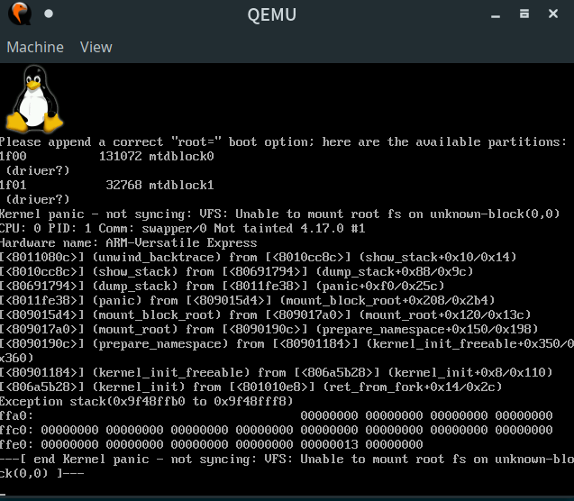

## 下载 Linux 最新版内核源码

[官方链接](https://cdn.kernel.org/pub/linux/kernel/v4.x/linux-4.17.tar.xz)

**解压 Linux 内核源码**

```shell
tar xaf linux-4.17.tar.xz 
```

## 实验环境

* ArchLinux amd64

### qemu

**qemu-system-arm**

```shell
yaourt -S qemu-arch-extra
```

### Arm toolchain

### arm gcc with gnu-eabihf

> 同时会安装 ==binutils== (汇编器和链接器, etc.) 还有 ==glibc== (C library 和 headers)的 `ARM` 版本


```shell
yaourt -S arm-linux-gnueabihf-gcc
```

> 提示 `未知的公共密匙 79BE3E4300411886`
> 解决方法: gpg 导入公钥 ==gpg --recv-key 79BE3E4300411886==

> 需要编译很多重量级软件, 大约 30min

## 指定编译环境和目标架构

```shell
export ARCH=arm # 目标 arch
export CROSS_COMPILE=arm-linux-gnueabihf- # 使用的编译链 prefix
```

> 也可以直接写在 ==Makefile== 指定位置或者 ==make ARCH=arm CROSS_COMPILE=arm-linux-gnueabihf-== 来指定.

## Setting up kernel configuration

configuration 可以用于指定哪些内核驱动/模块打开或关闭.

==make defconfig== 创建默认配置, 不过我们一般需要更多的配置, 使用 ==make menuconfig== 交互式的创建自定义 config.

我们这里使用 ==make vexpress_defconfig== 创建默认配置.

## make

==make -j 8==

> 8 个核心全跑满, 大概 4 min

**编译好的 kernel 在 ==arch/arm/boot/zImage==

## qemu 运行一下

```
env LANG=en.US qemu-system-arm -M vexpress-a15 -m 512 -kernel arch/arm/boot/zImage -dtb arch/arm/boot/dts/vexpress-v2p-ca15-tc1.dtb -append "console=tty1"
```



## 下载编译 busybox

```shell
wget https://busybox.net/downloads/busybox-1.28.4.tar.bz2
tar xjf ./busybox-1.28.4.tar.bz2
```

**using default config**

```shell
cd busybox-1.21.1
make  ARCH=arm CROSS_COMPILE=arm-linux-gnueabihf- menuconfig
make  ARCH=arm CROSS_COMPILE=arm-linux-gnueabihf- -j 8 install
```

这里有一个重要的配置，因为 busybox 将被用作 init 程序，而且我们的磁盘镜像中没有任何其它库，所以 busybox 需要被静态编译成一个独立、无依赖的可执行文件，以免运行时发生链接错误。配置路径如下：

> Busybox Settings —>
> — Build Options
> [*] Build BusyBox as a static binary (no shared libs)

> 将会安装到 ==_install== 目录

**添加一些重要的文件夹(作为 root dir)**

```shell
cd _install
mkdir proc sys dev etc etc/init.d
```

==/sbin/init== 一般是开机第一个被 kernel 运行的程序, 并且其默认的行为就是执行 == /etc/init.d/rcS== 中的内容.

记得添加权限 ==chmod +x etc/init.d/rcS==

### 打包成 **rootfs.img**

先安装一下 ==cpio==

```shell
$ sudo pacman cpio
```

打包

```shell
 find . | cpio -o --format=newc > rootfs.img
 ```
 
 这样带有 ==busybox== 的 ==rootfs== 就打包好了.

## 使用磁盘镜像文件作为根文件系统

> 假定在 linux 源码目录下

创建 512M 的磁盘文件并格式化为 ==ext4==

```shell
qemu-img create -f raw disk.raw 512M
mkfs -t ext4 ./disk.raw
```

挂载到新文件夹 ==./img==

```shell
mkdir ./img
sudo mount -o loop ./disk.raw ./img
```

## 安装 Linux Kernel image 和 busybox 到虚拟磁盘

在 linux 源码目录下

```shell
sudo make ARCH=arm CROSS_COMPILE=arm-linux-gnueabihf- \
modules_install \ # 安装内核模块
INSTALL_MOD_PATH=./img  # 指定安装路径
```

在 busybox 源码目录下

```shell
sudo make CONFIG_PREFIX=<path_to_disk_img_mount_point> ARCH=arm CROSS_COMPILE=arm-linux-gnueabihf- -j 8 install
```

> 记得在挂载点也必须按照前面说的创建一些根目录下的文件夹以及 ==etc/init.d/rcS==

 ## 运行 ==qemu== 模拟

```shell
env LANG=en.US qemu-system-arm -M vexpress-a15 -m 256M -kernel arch/arm/boot/zImage -drive format=raw,file=./disk.raw \
-append "root=/dev/sda init=/linuxrc console=tty1"
```

> 模拟的是 ARM-v7h A15 架构, 假设 ==disk.raw== 就在当前目录

## 参考

http://devarea.com/building-embedded-linux-system-with-qemu/#.WxoUmSRfhhE

https://github.com/surajx/qemu-arm-linux/wiki/Compile-Linux,-BusyBox-for-ARM-and-load-it-using-QEMU

https://hellogc.net/archives/121