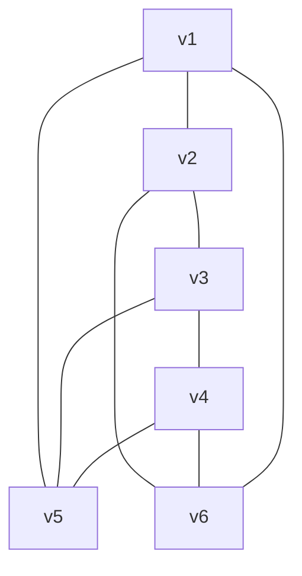
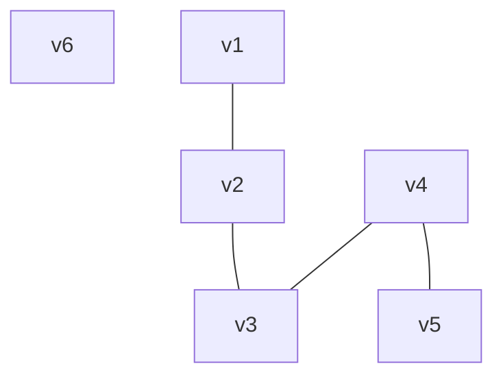
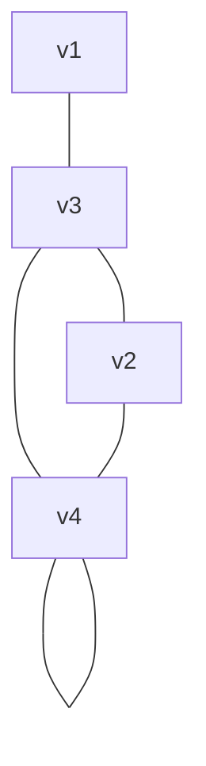
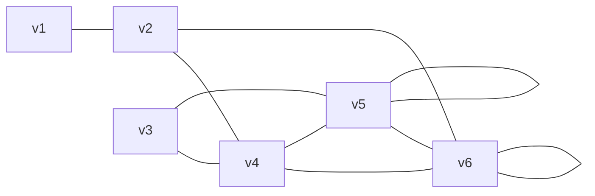
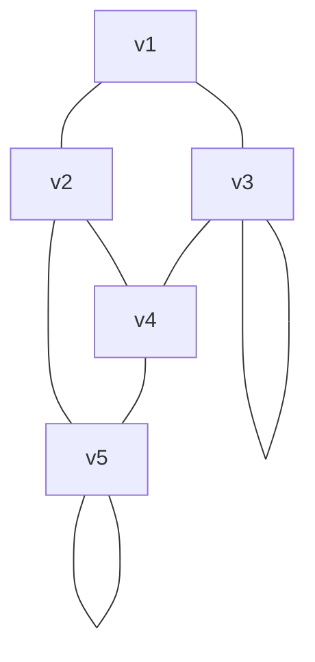

## 1

### (1)

**存在**



**解释**

因为总的度数和 TD = 3 x 6 = 18 为偶数并且小于 30(六个顶点组成的完全图的度数和), 所以必定存在这样的图.

> 这种图参考三棱柱

###  (2)

**不存在**

**解释**

因为按照 ==定理 5.1.1== (P69), 总的度数必定为 **偶数**, 而本题中度数为 **3 x 15 = 45** 不是偶数, 所以不存在.

### (3)

**不存在**

**解释**

因为按照 ==定理 5.1.1== (P69), 总的度数必定为 **偶数**, 而本题中度数为 **1 x 5 = 5** 不是偶数, 所以不存在.

### (4)

**存在**



**解释**

6 个顶点的完全图有 `!$\frac{6 \times 5}{2} = 15$` 条边, 也就是说, 6 个顶点的无向图最多有 15 条边, 所以题目的 4 条边是完全可行的.

### (5)

**不存在**

按照 ==定理 5.1.1== (P69), 边数 `!$e = \frac{1}{2} TD = \frac{1}{2} (1 + 2 + 3 + 4) = 5 \ne 4$`( TD 代表总的度数合), 与题设的 4 条边相矛盾, 错误.

### (6)

**存在**



**解释**


因为总的度数和 TD = 10 为偶数并且小于 12 (4 个顶点组成的完全图的度数和), 所以必定存在这样的图.

### (7)

**存在**



因为总的度数和 TD = 20 为偶数并且小于 30 (六个顶点组成的完全图的度数和), 所以必定存在这样的图.

### (8)



**解释**

因为总的度数和 TD = 18 为偶数并且小于 20 (5 个顶点组成的完全图的度数和), 所以必定存在这样的图.

### (9)

**不存在**

**解释**

因为按照 ==定理 5.1.1==, 总的度数必定为 ==偶数==, 而本题总的度数为 15 为奇数, 所以不存在.


## 2

### (a)

```mathjax!
\begin{bmatrix} 0 & 0 & 1 & 1 & 0 \\ 0 & 0 & 0 & 0 & 1 \\ 1 & 0 & 0 & 0 & 0\\ 1 & 0 & 0 & 0 &  0\\0 & 1 & 0 & 0 & 0\end{bmatrix}
```

* 无向无权图
* 二部图
* 非欧拉图
* 非连通图
* 非完全图

### (b)

```mathjax!
\begin{bmatrix}0 & 0 & 1 & 1 & 0 \\ 0 & 0 & 0 & 0 & 1\\ 1 & 0 & 0 & 0 & 1\\ 1 & 0 & 0 & 0 & 0\\ 0 & 1 & 1 & 0 & 0\end{bmatrix}
```

* 无向无权图
* 二部图
* 非欧拉图
* 非完全图
* 连通图

### (c)

```mathjax!
\begin{bmatrix}0 & 1 & 1 & 1 & 1 \\ 1 & 0 & 1 & 1 & 1\\ 1 & 1 & 0 & 1 & 1\\ 1 & 1 & 1 & 0 & 1\\ 1 & 1 & 1 & 1 & 0\end{bmatrix}
```

* 无向无权图
* 完全图
* 连通图
* 欧拉图
* 非二部图

### (d)

```mathjax!
\begin{bmatrix}0 & 0 & 0 & 0\\ 1 & 0 & 1 & 0\\ 1 & 0 & 0 & 0\\ 1 & 0 & 0 & 0\end{bmatrix}
```

* 有向无权图
* 非连通图
* 非完全图
* 非欧拉图
* 非二部图

