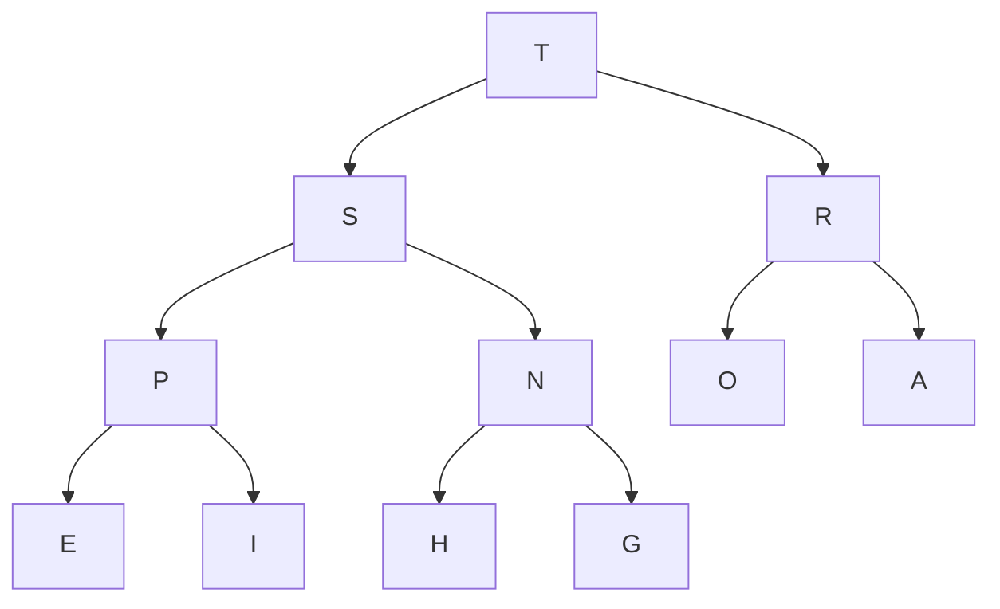

# (p)1 Fundamentals

## 重定向和管道

% java Average < data.txt

相当于:
data.txt -> standard input -> Average

% java RadomSeq 100 1 2 > data.txt

相当于:
RandomSeq -> standard output -> data.txt

% java RandomSeq 100 1 2 | java Average

相当于:
RandomSeq -> standard output -> standard input -> Average

## 递归(Recursion)

**递归三准则:**

* 递归有一个基准情形 (base case): 一个包含==return==的条件语句作为递归的第一条语句.
* 递归调用越来越处理 (adress) 更小的子问题 (subproblems) , 使递归调用慢慢的向基准情形 (base case) 靠拢.
* 递归调用间不能处理到重叠 (overlap) 的子问题.

违背这三条准则会导致不正确的结果或者极低的效率.

## 0. 二分查找

可以用for循环或者递归两种方法实现.

 O(logN)的时间复杂度
 
 源码见tk.dcmmc.fundamentals.Algorithms.BinarySearch.java

## 1. 欧几里德算法 (Euclid's Algorithm)

证明:
首先证明引理 gcd(a, b) = gcd(b, a mod b)
 假设 a = bq + r, 且a, b的最大公约数是d
1) d|a, d|b, 所以d|(a - bq), 即d|r, 所以d也是r的约数, 所以d是b, r的最大公约数.
2) 假设d是b和r的最大公约数, 即d|b, d|r, 所以d|(bq + r), 即d|a, 所以d是a, b的最大公约数.
证毕

由上面的引理不难递归出 gcd(a, b) = gcd(b, r1) = gcd(r1, r2) = ... = gcd(rn-1, rn) = gcd(rn, 0);
且b > r1 > r2 > ... > rn > 0 = rn+1, 以及rn-1能够被rn整除, 所以gcd(a, b) = gcd(rn-1, rn) = rn;

实现:
``` java
/**
	* Ex 1.1.25 
	* 欧几里德辗转相除求最大公约数
	* @param p nonzero int num.
	* @param q nonzero int num.
	* @return gcd of p and q.
	* @throws IllegalArgumentException p, q非0且|p| >= |q|.
	*/
int gcd(int p, int q) throws IllegalArgumentException {
		//取绝对值
		p = Math.abs(p);
		q = Math.abs(q);

		if (p < q || p == 0 || q == 0)
			throw new IllegalArgumentException("要求: p, q非0且|p| >= |q|\n但是, 参数p = " + p + ", q = " + q);

		if(p % q == 0)
			return q;
		else 
			return gcd(q, p % q);
	}
```

## ADTs(Abstract Data Types)

ADT是一种能对使用者(clients)隐藏数据表示的数据类型, 并且该类型跟很多的方法实现(APIs)相关联(就跟基本数据类型(`primitive data type`)和操作符(`operators`)相关联一样).

在OOP(Object-Oriented Programming)语言中常常把ADT封装(encapsulation)在一个类(class)中.
用APIs的实现来描述算法和数据结构.

把算法封装在ADT中, 能够在不影响client代码的同时为了提高性能更换算法.

ADT用法示例: [Github-Exercise 1.2](https://github.com/DCMMC/Java/blob/master/Algorithms/tk/dcmmc/fundamentals/Exercises/DataAbstraction.java)

## 背包(Bag)

Bag是一种只能添加元素不能删除元素, 可以元素迭代(比如使用foreach)的ADT.

## Queue (FIFO)

经常用于 **广度优先搜索(Breadth First Search)** 的实现.

先进先出.

比如foreach的时候, 先进去的元素会被foreach先遍历到的.

**在状态空间中搜索路径: 找到一条路径(相邻状态间转移合法), 从开始状态到结束状态, 途中不经过不安全状态.**

## 2. Stack (LIFO)

经常用于 **深度优先搜索(Depth First Search)** 的实现

后进先出.

一个简单应用: Dijkstra双栈算术表达式求值算法:

为了方便起见, 假设算术表达式只由数字, +, -, \*, /, sqrt, 括号和空格组成, 且没有省略任何括号(也就是暂时不考虑操作符的优先级), 数字和字符均以空白符相隔.
i.e., ( 1 + ( ( 2 + 3 ) \* ( 4 \* 5 ) ) )

然后对字符串从左往右解析并处理这些实体:
* 将操作数压入操作数栈
* 将运算符压入运算符栈(不包括括号)
* 忽略左括号
* 遇到右括号时, 弹出一个运算符, 弹出所需要数量的操作数, 并将运算符和操作数的运算结果压入操作数栈

## 实现方法

上述三种ADTs(Bags Stacks Queues) 都可以使用一下三种方式实现:
* fixed-capacity array 固定大小数组
* resizing-capacity array 可变大小的数组
* Linked List 链表

> 其中数组实现的栈还有一种 **共享栈** 的实现:
> 让多个栈共用一个预分配的较大的存储空间, 利用栈的动态性使他们的存储空间互补.
> e.g. 双向共享栈: 在一个一维数组空间中维护一个lefttop和righttop分别作为两个栈的栈顶, 并且lefttop向右, righttop向左, 直到相遇就代表着栈满.
> ![共享栈][1]

> 数组实现的队列还有一种 **循环队列** 的实现:
> 将顺序队列构造为一个假想的环形结构, 开辟一个一维数组给循环队列, 然后维护一个 capacity, front 和 rear来记录队列容量, 队列头和尾的 offset.
> dequeue和enqueue分别相当于 (front + 1) % capacity 和 (rear + 1) % capacity.

推荐使用SLL(Single Linked List)或者DLL(DoubleLinkedList)方式实现.

## 算法分析

### 算法分析常用函数

`!$\lfloor x \rfloor$` 向下取整, 不大于x的最大整数
`!$\lceil x \rceil $` 向上取整, 不小于x的最小整数
`!$\lg N$` 以2为底的对数(`!$\log _2{N}$`)
`!$H_N$`, i.e., `!$1+\frac {1} {2}+\frac {1} {3} +...+\frac {1} {N}$` 调和级数

### 算法分析常用近似函数

* `!$H_N$` ~ `!$\ln N$` (证明见高数无穷级数章节)
* `!$\sum N$` ~ `!$\frac {N^2} {2}$`
* `!$\lg N!$` ~ `!$N\lg N$`
* `!$(1-\frac {1} {x})^x$` ~ `!$\frac {1} {e}$` (见高数等价无穷小)
* `!$\dbinom {N} {k} = \frac {N!} {k! (N-k)!}$`(二项式系数, i.e., N取k的组合) ~ `!$\frac {N^k} {k!}$`

> **定义**:
> g(N) ~ f(N) 即 `!$\sum_ {N \rightarrow \infty} \frac {g(N)} {f(N)} = 1$`

计算loop的增长数量级:
e.g.
ThreeSum中的三重循环中
`!$\sum_ {i=1} ^N \sum_ {j=i+1} ^N \sum_ {k=j+1} ^N 1$` ~ `!$\int_{x=1} ^N \int_{y=x} ^N \int_{z=y} ^N \mathrm {d}z \mathrm {d}y \mathrm {d}x$` ~ `!$\frac 1 6 N^3$`


### 增长数量级(时间复杂度)
* 常数级别 1
* 对数级别 `!$\log N$` e.g. 二分查找
* 线性级别 N 
* 线性对数级别 `!$N \log N$` e.g. 归并查找(分治)
* 平方级别 `!$N^2$` 
* 立方级别 `!$N^3$`
* 指数级别 `!$2^N$` e.g. 穷举查找, 检查所以子集

### 倍率定理(近似模型)

如果T(N) ~ `!$aN^b\lg N$`(幂次法则的数学模型), 那么T(2N)/T(N) ~ `!$2^b$`
**Proof:** 
T(2N)/T(N) = `!$a(2N)^b\lg 2N$`/`!$aN^b\lg N$`
 = `!$2^b(1+ \frac {\lg 2} {\lg N})$`
 ~ `!$2^b$`
当N足够大的时候, 忽略就能很小了.

**推广:** T(kN)/T(N) ~ `!$2^k$`(k就是每次测试数据规模与上一次测试的数据规模的比值)

> **大O记法:**
> 如果`!$\exists c$`和`!$N_0$`, 使得对于所有`!$N > N_0$`都有`!$|f(N)| < cg(N)$`, 则称`!$f(N)$`为`!$O(g(N))$`

`!$O(g(N))$`也就是`!$g(N)$`为运行时间的**上限**.

> **大Omega记法**
>  如果`!$\exists c$`和`!$N_0$`, 使得对于所有`!$N > N_0$`都有`!$|f(N)| > cg(N)$`, 则称`!$f(N)$`为`!$\Omega (g(N))$`

`!$\Omega (g(N))$`, 那么也就是`!$g(N)$`为运行时间的**下限**.

> **大Theta记法**
> 如果`!$f(N)$`即是`!$O(g(N))$`又是`!$\Omega (g(N))$`, 那么称`!$f(N)$`为`!$\Theta (g(N))$`

大Theta记法用来描述算法的**最优性能**.


### 均摊分析(Amortized Analysis)

记录所有操作的总成本再除以总操作数.
这种情况可以允许少量开销很大的操作, 只要使平均开销小于预估上限就行.
典型的例子就是那个resizeing-Capacity array实现的Stack, 在触发resize指令的时候开销很大, 不过总的平均每操作的开销可以达到常数级别(即使在最坏的情况(worst-case)下).


### 内存开销

JDK在intel64 bits平台上的实现(不带引用/指针压缩的)是最小单位为8bytes(64bits), 也就是一个word.
例如一个一下代码创建的实例对象, 需要24bytes:
~~~ java
class ObjWithOneBoolean {
	boolean bool;
	String refObj;
}
~~~
* Object需要12~16bytes(64bits JDK实现, 32bits系统的JDK实现为8bytes)的head(或称overhead),  head中包含了这个object的Class对象的引用, 垃圾回收的信息, ID and status flags such as whether the object is currently reachable, currently synchronization-locked etc.(不过基本类型数组的head需要加上4bytes用来储存length)
* 基本类型存储区域: 一个boolean需要1byte
* 引用类型存储区域: 每个引用(pointer)大小的8bytes(64bits JDK实现, 32bits的实现就是4bytes的指针).
* 因为64bits系统最小内存单位都是8bytes, 为了使整个对象的大小为8(32bits系统的JDK实现就需要4的倍数)的倍数bytes, 最后还需要3bytes的padding用来对齐.

如果有成员内部类, 因为成员内部类需要一个指向外部类的开销:
e.g.
~~~ java
class ObjWithInnerClass {
	byte b; //1byte
	int i;//4bytes
	boolean bool;//1byte
	double d;//8bytes
	Objet objref;
	class Node { //8bytes, pointer to OuterClass
		int item;//4bits
		Node next;//8bytes
	}
}
~~~

内存结构:
* 12bytes的overhead
* d: 8bytes
* i: 4bytes
* bool: 1byte
* b: 1byte
* objref: 8bytes
* 用于Node指向外部的引用(extra head)
* item: 4bytes
* next: 8bytes
* padding: 6bytes

> hotSpot为了减少padding的占用, 会适当的调节这些变量和引用在内存中的相对位置, 所以他们的内存结构中的顺序并不会和代码声明的顺序相同.

> 可以通过[Java Object Layout](http://openjdk.java.net/projects/code-tools/jol/)查看内存占用详细情况

> 还可以直接使用java.lang.Instrument.getObjectSize()查看对象占用内存大小

[参考](http://pcpig.iteye.com/blog/1206902)
[Java对象内存占用分析](https://segmentfault.com/a/1190000006933272)

对于二维数组int\[5][6], 第一维度是一个存储有5个引用变量的对象, 然后为一个引用变量又指向一个存储了6个int的对象.

当一个方法被调用的时候, 系统会从栈内存中为方法分配所需的内存(用来保存局部变量), 当方法返回的时候, 内存会重新被返回栈内存.
当使用new创建对象时, 系统会从堆内存中为该对象分配所需的内存.

### 比较算法的一般步骤

* 实现并且调试这些算法
* 分析他们的基本性质(时间空间复杂度)
* 制定一个比较他们性能的猜想(假说)(可以基于某些定理)
* 进行实验来验证上述猜想

# 排序算法

## 3. 选择排序(Selection Sort)

时间复杂度不太取决于目标数组, 反正效率都不高

一次一次的找到每一轮的最小值并放到这一轮的第一个位置

~ 1/2N^2(固定这么多次) compare, ~ N(最差情况下) exchange

数据交换这一方面的开销小是优点, 总的效率低的缺点

## 4. 插入排序(Insertion Sort)

时间复杂度比较取决于目标数组, 目标数组越接近于完全正序, 时间复杂度就越低

交换的次数就是逆序数对的对数, 比较的次数就是交换的次数+(N-1)

平均情况下(这里取的是每一个item都是进行到一半就找到了位置), 比较 ~ 1/4N^2, 交换 ~ 1/4N^2

在最坏情况(完全倒序), 比较 ~ 1/2N^2, 交换 ~ 1/2N^2

最好情况(完全正序), 比较 ~ N-1, 交换 0

## 5. 希尔排序(Shell Sort)

在最糟糕的情况下时间复杂度为O(N^1.5), 一个小小的改进就能从InsertionSort的O(N^2)降低到 O(N^1.5)(而且是最坏情况)

平均下的时间复杂度不确定, 取决于increment sequence的选取.

InsertionSort在每一轮插入的时候需要跟相邻的元素一个一个交换, 这样很消耗资源, 希尔排序作为插入排序的扩展,

每次比较并交换的间隔不再是1(h=1这一特殊情况下h-sorting就是InsertionSort), 而是大于1的不同的步长.

**定义(Def.): h-sorting**

> 如果数组中的元素任意间隔h都是有序的, 那就称为h-sorting array, e.g., `1 2 3 4 5 6 7`, 取h为2, 则子序列1 3 5 7和子序列2 4 6分别都是有序的(即有h个互相独立有序的子序列交错组合在一起), 则该数组是h-sorted array
> 
> h-sorting即以h为间隔对子序列进行排序, e.g., 对序列` 1 5 8 2 3 4 6 7 6 8 9 `(共11个元素), 以h = 3进行h-sorting,
> 首先这个序列拆分为一下3个子序列: `1 2 6 7`和`5 3 7 9`和`8 6 4`, 然后依次对这三个子序列进行InsertionSort, 得到`1 2 6 7, 3 5 7 9`和`4 6 8`这三个子序列, 合并之后为: `1 3 4 2 5 6 6 7 8 7 9`, 这个序列就被称为原序列以h=3的h-sorted array
> 
> 一个更好的理解就是把序列放在一个h列的表中, 然后对其形成的二维表的每一列进行InsertionSort:
> 
> 1 5 8 2 3 4 6 7 6 8 9以h=3:
> 
> 5 8 
> 2 3 4
> 6 7 6
> 8 9
> 
> 然后依次对第一第二第三第四列进行InsertionSort:
> 
> 1 3 4
> 2 5 6
> 6 7 8
> 7 9


ShellSort大体的原理是以一系列值(increment sequence)作为h(又叫步长), 由大的h到小的h来对序列进行h-sorting, 只要该h序列最后的h是1,
就一定能得出排序好的序列, 比如 5 3 1就是一个h序列, 先以h=5对原序列进行h-sorting, 然后再以h=3进行h-sorting, 最后以h=1进行h-sorting.
不过从１开始然后不断乘以２这样的序列的效率很低，因为１后面都是偶数，彼此ｈ-sorting排序都是错开的的.

而公认的最好步长序列是由Sedgewick(本书作者)提出的`(1, 5, 19, 41, 109,...)`，该序列的项来自`!$9 \times 4^i - 9 \times 2^i + 1$` 和`!$2^{i + 2} \times (2^{i + 2} - 3) + 1$` 这两个算式合并起来的结果.
用这样步长序列的希尔排序比插入排序要快，甚至在小数组中比快速排序和堆排序还快，但是在涉及大量数据时希尔排序还是比快速排序慢。

另一个在大数组中表现优异的步长序列是（斐波那契数列除去0和1将剩余的数以黄金分区比的两倍的幂进行运算得到的数列）

不过一般使用的序列是 ==Knuth== 提出的由递推公式 `!$h = h \times 3 + 1$` 确定的数列(转成通项公式即为`!$\frac {1} {2} (3^k - 1)$`, 这个序列在元素数量比较大的时候,
相比于 ==SelectionSort== 和 ==InsertionSort== , 性能按照数组大小以2的次幂递增.
使用 ==Knuth== 提出序列的比较次数大概为N的若干倍再乘以这个序列的长度(差不多约为`!$N^{1.5}$`, 由大量N很大的实验可以估算出)

虽然使用最优的序列的时候, 在对小数组排序性能有时候可以超过 ==heapsort== 和 ==quicksort== , 不过在大量数据的时候还是慢于后两个, 不过相比于
后两者复杂一些的实现, ==ShellSort== 只需少量代码而且对资源的消耗也比较小, 所以适合用在嵌入式系统这些比较重视资源的场景中.

## 6. 归并排序(MergeSort)

核心是归并: 把两个已排序的子序列归并成一个已经排序的序列.

Top-down mergesort:

采用递归和**分治思想**把一个序列不断的二分, 直到子序列只有一个数值, 这样一个数的子序列肯定是排序好的, 然后直接开始不断归并.

Bottom-up mergesort:

采用自底向上的方法非递归的归并排序数组

先把整个数组分为最小的情况(也就是每个子数组长度为1), 先这样进行归并, 然后按照数组长度为2进行归并, 子数组长度每次都是上一轮归并的子数组的长度的两倍. 直到能够归并整个数组.

每一轮最多需要N次比较, 并且需要logN轮, 所以总的时间复杂度为NlogN.

总的空间复杂度为O(logN), 因为这是一个递归程序, 并且总有logN层递归, 每一次递归的返回值都要保存在Stack中, 所以需要O(logN)的空间消耗.

Bottom-up mergesort可用于原地排序LinkedList.

### **分治思想**

把一个复杂的问题不断分成很多小的子问题, 首先解决这些子问题, 然后用这些子问题的结果去结果整个问题. 分治思想常常涉及到递归. 

**对于一个大小为N的数组, 采用自顶向下(top-down)的mergesort的方法进行排序, 比较次数在 `!$\left[ \frac {1} {2} N \lg N, \ N \lg N\right]$`**

**Proof.**

定义函数 `!$C(N)$` 表示排序一个长度为N的数组的比较次数, 显然: `!$C(0) = C(1) = 0$`, 
而且对于 `!$N > 0$`, 在递归方法 mergeSort() 中, 有此上界:

```mathjax!
$$C(N) \leq C\left( \lfloor \frac {N} {2} \rfloor \right) + C\left( \lceil \frac {N} {2} \rceil \right) + N $$
```

最后一个N表示merge花费的最多比较次数.

并且同时有此下界:

```mathjax!
$$C(N) \ge C\left( \lfloor \frac {N} {2} \rfloor \right) + C\left( \lceil \frac {N} {2} \rceil \right) + \lfloor \frac {N} {2} \rfloor $$
```
 `!$\lfloor \frac {N} {2} \rfloor$` 表示merge所花费的最少比较次数, 正好就是两个子序列直接合在一起(前后两部分反着合起来运算)就是完全有序的了, merge还是需要花费一半的比较次数来比较前半部分, 到了i > mid或者j > hi的时候, 就不需要比较了.
 
 为了方便计算, 这里假设 `!$N = 2^n , \ \therefore \lfloor \frac {N} {2} \rfloor = \lceil \frac {N} {2} \rceil = 2^{n - 1}$`
 
 于是上界:
 `!$ C(N) = C(2^n) = 2C(2^{n - 1}) + 2^n$`
 
 左右同除以 `!$2^n$`, 得到:
 
 
 `!$ \frac  {C(2^n)} {2^n} = \frac {C(2^{n - 1})} {2^{n - 1}} + 1$`, 这是一个等差数列, 
 
 易得: `!$\frac {C(2^n)} {2^n} = \frac {C(2^0)} {2^0} + n, \Rightarrow C(N) = C(2^n)  = n2^n = N \log N $`
 
 另外一个证明方法为:
 
 mergeSort采用递归和分治思想, 把整个序列分为了 在二叉树的kth level, 共有`!$2^k$`个merge调用, 而且每个merge调用都需要最多比较`!$2^{n - k}$`次, 所以在每一个level都需要`!$2^k \cdot 2^{n - k} = 2^n$`次比较, 所以对于有n个level的二叉树状mergeSort中, 共需要`!$n2^n$`次比较, 又对于N个结点的二叉树, 其深度为`!$\log_2 N$`, 所以总共的最多比较次数为`!$N \log N$`.
 
 **Top-down 和 Bottom-up mergesort 最多需要 6NlogN次数组访问**
 
 **Proof.**
 
 每一次merge最多访问数组6N次: 2N次用于数组访问, 2N次用于移动回去, 还有最多2N用于比较.
 
 **所以MergeSort的平均时间复杂度为O(N logN), 空间复杂度为O(N)**
 
 ### **优化**
 
 * 对于较小的子序列, 使用InsertionSort会比默认的merge更加的高效(能够提高10%-15%),  see Exercise 2.2.23.
 * 在merge()中添加对a[mid] <= a[mid + 1]的情况的校验, 如果a[mid] <= a[mid + 1], 那么就不进行归并, 这样能够在处理完全有序的序列时达到线性时间复杂度, see Exercise 2.2.8
 * 消除暂存数组的复制操作: 每一次merge都要对子序列进行复制, 这样会造成复制数据的时间开销(空间开销不变), 设计两次sort()调用, 一次从数组中取出那些数据, 然后将归并好的结果放入暂存数组中, 另外一次就从暂存数组中取出数据然后将归并好的结果放入原数组, 这样两个数组同时工作在递归中, 减少复制的开销. 这需要一定的递归技巧. see Ex 2.2.11

> P.S. 不是说一定要每次都实现这些所有的优化, 而是我们应当注意: 不要对一个算法的初始性能下绝对的结论, 很多时候还有很多优化的空间.

研究一个新问题的时候, 最好的方法是先用最简单的方法实现, 然后在这个方法成为瓶颈的时候再去重新实现一个新的算法. 实现那些仅仅带来参数因子的优化可能并不值得, 并且在每次优化之后最好一定要进行科学的实验(就像书上的练习一样).

### **Computational Complexity of MergeSort**

**所有的基于比较的排序算法的在最坏情况下的比较次数的下界(low bounds)为 log(N!)~N logN(see P185 Stirling's approximation: log(N!) = log1 + log2 + ... + logN ~ NlogN)**

**Proof.**

构造一个适用于所有compare-based sorting algorithms的**二叉决策树(decision tree)**, 在compare-based sorting algorithms中, 树中的每一个 **内部结点(internal node)** 表示一次比较, 每一片 **叶子(leaf)** 表示完整排序后的序列.

显然, 对于长度为N的序列, 叶子的最少个数为N!, 即有N!中不同的排列可能. 否则如果少于N!, 说明有一些排列的可能会被遗漏, 不过可以多于N!, 因为有可能出现重复的叶子.

从root到某一个leaf之间的路径上结点的个数即为这种情况下比较的次数, 最长的那一条路径叫做树的**高度**, 它代表最坏情况下的比较次数.

又显然, 一棵高度为h的二叉树, 最多有`!$2^h$`片叶子(当且仅当为**完全二叉平衡树**的时候).

综上所述, 高度为h的二叉决策树的叶子的数量在 `!$\left[ N!, \ 2^h\right]$`区间内.

所以比较次数至少为 `!$\log (N!)$` ( ~ `!$N \log N$`)次.

> P.S. 如果算法会对某些特殊顺序的序列进行优化或者算法能够了解到序列的值的分布或者序列的初始顺序或者有重复key之类的情况, 上述下界将不再适用.

除了在最坏情况下的比较次数的下界已经是确定的了, 还有很多因素需要关注: 空间占用, 一般情况下的时间复杂度, 不基于比较的排序算法, 数组访问次数等等.

## 7. Knuth(Fisher-Yates) shuffle算法

原地(in-place)随机打乱一个数组, 并且是等概率的随机排列数组, 时间O(n), 空间O(1).

算法实现见: tk.dcmmc.sorting.Algorithms.ArrayShuffle.java.

**Proof.**

要使第`!$k(1 \leq k \leq N)$`个元素被交换在第`!$i(1 \leq i \leq N)$`个元素的位置上, 即如下两种情况:

* 如果k < i, 前i - 1轮交换都不可能把k交换到i的位置, 所以不用管, 然后第i轮交换一定要保证k交换到了i的位置, 也就是`!$\frac {1} {i - 1}$`的概率, 然后还要保证i + 1 ... n轮都没有把k从i的位置上被交换到其他位置. 
* 如果i <= k, 前k - 1轮交换都不需要管, 第k轮交换一定要确保i被交换到了k的位置上, 即`!$\frac {1} {k - 1}$`, 然后还要确保k + 1...n轮交换都没有把i从k的位置上被交换到别的位置.

以第二种情况为例计算其概率:

```mathjax!
$$P_{i \to k} = \frac {1} {k - 1} \cdot \frac {k - 1} {k} \cdot \frac {k} {k + 1} \cdot \cdot \cdot \frac {n - 1} {n} = \frac {1} {n}$$
```

证毕.

## 8. Quicksort

QuickSort也是一种**分治思想**在排序中的应用的算法. 

而且QuickSort和MergeSort是相互补充的, 和MergeSort的递归方式有所不同, MergeSort是先折半(half)递归然后再归并(merge), QuickSort是先分区(Partition)再递归分支(不一定是折半, 取决于分区的时候找到的位置).

优点: 实现比较简单, 相当少的数据移动次数, 每一轮的比较次数都是固定的N + 1, 时间复杂度和空间复杂度都相当优秀

缺点: 很多小的细节容易导致严重的性能损失, 有时候甚至达到了N^2的时间复杂度; 而且在partition树不平衡的时候超级低效, 比如第一个partition item是最小的数, 然后就只会交换移动一个顺序, 造成在大数组中调用过度的partition次数.

**原地分区(In-place Partition)**

把目标范围中的第一个元素a[lo]放在指定的位置: 左边的subarray的所有元素都小于等于a[lo], 右边subarray的所有元素都大于等于a[lo], 然后把a[lo]换到这个位置来.

基本策略:

i, j这两个下标分别从要分区的范围的下界和上界开始, 逐渐向中心递推, 直到遇到a[i]大于(等于)a[lo], a[j]小于(等于)a[lo],
这时候如果i < j(也就是没有交叉), 就将a\[i]和a\[j]交换, 直到没有可以交换的, 这时候j的位置就是a[lo]的最终位置.

 一些坑:
 
1. 这里采用的是原地排序, 如果使用额外的数组会更加容易实现, 不过这中间产生的复制数组的时间消耗会非常大.
2. 两个inner loop都有边界检查, 防止出现partition是数组中的最大或者最小值倒是超出范围的情况.
3. 保持随机性: 对于程序运行时间的可预测性至关重要, 相当于每一次都是随机得对待子数组中的所有元素, 另外一个方法是在partition()中随机的选取partition item来保持随机性. 保持随机性是为了防止partition树极度不平衡的情况, 也就是像上文中的缺点所指出的那种情况, 避免产生过多的partition次数, 至少要避免连续产生这种糟糕的partition.
4. 避免死循环, 控制loop的出口(i >= j), 很多时候因为subarray中有与partition item相同的值的元素造成死循环.
5. 处理好subarray中的与partition item相同的值的元素, inner loop的条件一定不能是 <=, 因为在遇到大量与partition item相同值的元素的情况, 例如所有元素都是一样的值, 这时候两轮inner都会该死的遍历所有元素, 并且j还tm就是l这样效率爆炸般得达到了N^2, 如果元素再多一点(>2.5w个), 就直接爆栈了. 如果是<而不是<=的话, 就算遇到这种情况, j也是(lo + hi) / 2的样子, 有种二分的感觉,虽然exch()的调用看起来有点冗余, 不过至少比爆栈好... 见到Ex 2.3.11
6. 注意递归边界

**算法分析:**

在最理想情况, 每一次j都是正好在subarray的中间位置, 也就是每次都能二分, 这样和mergesort一模一样, 时间复杂度为 ~ NlogN

**Quicksort排序N个不同的数字平均使用 ~ `!$2 \ln N$` (`!$\dot {=} 1.39N \log N$`)的比较次数(以及1/6的的交换)**

**Prooof.**

设`!$C_N$`为排序N个(分散的)items所需要的平均比较次数, 易得`!$C_0 = C_1 = 0$`, 而且对于`!$N > 1$`, 有一下递归关系:

```mathjax!
$$C_N = N + 1 + \frac {\left(C_0 + C_1 + \cdot \cdot \cdot + C_{N - 2} + C_{N - 1} \right)} {N} +  \frac {\left(C_{N - 1} + C_{N - 2} + \cdot \cdot \cdot + C_{1} + C_{0} \right)} {N}$$
```

N + 1是每一轮排序的固定比较次数, 第二部分是排序left subarray的平均比较次数, 第三部分是排序right subarray的平均比较次数.

又将`!$C_N$`与`!$C_{N - 1}$`两式相减, 得到`!$NC_N = 2N + (N + 1)C_{N - 1}$`, 左右同除以N(N + 1), 得到 `!$\frac {C_N} {N + 1} = \frac {2} {N + 1} + \frac {C_{N - 1}} {N}$`, 令`!$\lambda_N =  \frac {C_N} {N + 1}$`, 所以递推得到

`!$C_N = 2(N + 1) \cdot \left( \sum_{i = 3}^{N + 1} \frac {1} {i} \right)$` ~ `!$2N\ln N$`

证毕.

> 交换次数的证法与上面类似不过更加复杂.

> 对于有重复数值的情况, 准确的分析复杂很多, 不过不难表明平均比较次数不大于`!$C_N$`, 后面将会有对这种情况的优化.


**Quicksort在最坏情况下花费 ~ `!$\frac {N^2} {2}$`的比较次数, 不过随机打乱数组将会极大的避免这种情况**

**Proof.**

最坏情况: 第一次partition的时候的partition item就是最小的那个值, 然后每一次右边partition都是把上次partition右边的元素全部遍历一次, 所以所花费的比较次数为:

```mathjax!
$$N + (N - 1) + \cdot \cdot \cdot + 2 + 1 = \frac {N(N + 1)} {2}$$
```
证毕.

这种情况下不仅是时间消耗为 ~ N^2, 而且递归调用的空间消耗也是线性的, 这样在处理大数组时就很容易发生爆栈.

不过值得一提的是, 发生这种情况的几率是相当小的(Ex 2.3.10), 可以安全的忽略.


**In Summary**
虽然Quicksort在一般情况下的比较次数(1.39N logN)大于mergesort()(1/2N logN ~ N logN), 不过Quicksort数据移动的次数相当少, 所以相对来说Quicksort会更加快.

### **优化**

这些优化大概能带来20%~30%的性能提升.

1. Cutoff to Insertion Sort (Ex 2.3.25)

因为Quicksort在处理小数组的时候速度还没有InsertionSort快, 所以可以通过cutoff来把小的数组用InsertionSort来处理.

2. Median-of-three partitioning (Ex 2.3.18 && Ex 2.3.19)

选取subarray中间三个元素作为partition item, 这会带来些许性能提升, 而且不需要做数组边界检查了.

3. Entropy-optimal sorting

在实际使用中, 数组中往往会有大量的重复keys, 比如subarra中所有元素都是一样的key的时候, 并不需要再把他们给partition成更加小的subarrays了, 不过原始版本的Quicksort还是会把他们给partition, 这时候可以把linearithmic-time优化到linear-time.

一个简单的方法是使用**3-way partitioning**, 这是由Dijkstra的**Dutch National Flag**问题推广出来的.

相比于原来的2-way partitioning, 2-way partitioning把array分为三个部分: 小于 等于 大于 partition item的三个部分.

**Dijkstra法:**

维持两个指针 **lt** 和 **gt**, **a[lo...lt - 1]** 为 **小于** partition item(简称**v**)的部分, **a[lt...i - 1]** 为 **等于** v的部分, **a[i...gt]** 为还没有处理的元素, **a[gt + 1...hi]** 为 **大于** v的部分. 

处理过程: 
从i = lo开始

* 如果a[i]小于v, 交换a[lt]和a[i], 然后lt++, i++
* 如果a[i]大于v, 交换a[i]和a[gt], 然后gt--
* 如果a[i]等于v, i++

所有遇到的元素除了等于v, 都会进行交换, 所以3-way交换次数要多于2-way, 在处理重复元素比较少的时候, 会产生较大的性能损失, 直到1990s的时候有人提出了更好的实现方法(Ex 2.3.22), 使得优化版本的3-way partition Quicksort在处理包含很多重复元素的实际应用比mergesort和其他排序算法都要快很多, 甚至突破了原来在mergesort中证明过的那个下界.

对于有固定个数个不同的key的数组(也就是有重复数值的数组), MergeSort为N logN的时间, 而用3-way partitioning实现的Quicksort则可以达到线性时间, 保守估计其上界为不同主键的个数乘以N的时间复杂度.

**没有任何(有可能有重复数值的)的基于比较的排序算法能够保证使用少于`!$NH - N$`比较排列含有k个不同数值的N个items, 其中H为Shannon Entropy: `!$H = - \sum_{i = 1}^{k} p_i \log p_i$`, `!$p_i$`为这k个不同数值的第i个数值在数组的个数除以整个数组的元素个数**

**Proof sketch**

对于有k(k <= N)个不同的数值的N个items的数组, 产生的不同的全排序为`!$\frac {N!} {\prod_{i = 1}^{k} x_i!}$`种(高中知识), 也就是在基于比较的排序的二叉决策树中最少应该有`!$\frac {N!} {\prod_{i = 1}^{k} x_i!}$`(`!$x_i$`为k个不同的数值中的第i个在整个数组中的个数)片叶子(可参见MergeSort中相关证明过程), 所以需要的比较次数为

```mathjax!
$$\log \left( \frac {N!} {\prod_{i = 1}^{k} x_i! } \right)$$
$$= \log N! - \sum_{i = 1}^{k} x_i!$$
$$\simeq N \log N - N \sum_{i = 1}^{k} \left( \frac {x_i} {N} \log x_i \right)$$
$$= N \log N  - \sum_{i = 1}^{k} \log N - N \sum_{i = 1}^{k} \left( \frac {x_i} {N} \log \frac {x_i} {N} \right)$$
$$= N \log N  - N \cdot k \log N + N H$$
$$= N H + N \cdot ( 1 - k ) \log N$$
$$\simeq N H - N$$
```

**Quicksort with 3-way partitioning 使用 ~ (2 ln2) N H次比较来排序N items, 其中H是Shannon entropy**

**Pf. sketch**

通过Quicksort在N个数值全不相同的时候的平均比较次数的证明一般化到有重复数值的情况可以得出上述结论, 不过**证明过程较为复杂**(B. Sedgewick 在1990s证明过).

这比较次数比上个结论中的最理想情况需要多花费39%的比较次数, 不过还是术语常数因子的范围内.

> 注意当所有的keys都不相等时, H = logN(也就是`!$\forall i \in [1, N], p_i = \frac {1} {N}$`)

> 当数组中含有大量的重复数值的时候, Quicksort with 3-way partitioning能够把linearithmic time优化到linear time

## 9. Priority Queue

### **基本实现**

思路:

1. lazy approach(unordered): 类似于用resizing-array实现的pushdown stack, 每一次insert操作跟stack的push一样, 时间O(1), 然后在remove the maximum操作的时候, 用类似于selection sort的inner loop的思路来把最大的元素交换到数组的结尾, 然后pop出来, 时间O(n).
2. eager approach(ordered): insert的时候把右边的这个较大的元素移动一个位置来使当前操作的key放在正确的位置上(类似与InsertionSort), 时间O(n), 然后remove the maximum的时候直接把最右边的key返回并删除就好了.
3. 使用Linked List, 又该pop或者push方法来实现(按照上面的思路), 时间消耗也是一样的, 反正一个是O(1)一个是O(n).


**Def. `heap-order` 的 binary tree**

每一个node都要大于等于它的(两个) children node. 同样地, 每一个node都要小于等于它的parent node. 这样便可以保证: Moving up from any node, we get a nondecreasing sequence of keys; moving down from any node, we get a nonincreasing sequences of keys.

显然, 在heap-ordered binary tree中最大的key就是root node.

**Def. binary heap**

binary heap就是一组在完全heap-ordered binary tree(**也就是假设这棵tree有n level, 从 1 到 (n - 1) level都是满的**)中的元素, 并在数组中按照层次进行存储(不存储第一个元素), 也就是从底层到顶层, 一层一层从左到右把node中的key存储在数组中(好像是前序遍历吧).

简略理解就是: **Complete binary tree represented as array**

e.g.

i     | 0 | 1 | 2 |  3 |  4 | 5 |  6 |  7 |  8 | 9 | 10 | 11
--|--|--|--|--|--|--|--|--|--|--|--|--
a[i] | - | T | S | R | P | N | O | A | E | I | H | G 

表示:



其中数组的1 ~ 1表示level 1, 2 ~ 3表示level 2, 4 ~ 7表示level 3, 8 ~ 11表示level 4.

**对于完全heap-ordered binary tree(也就是假设这棵tree有n level, 从 1 到 (n - 1) level都是满的, 第 n 个 level 也是从左到右依次排满的), 它对应的binary heap在数组中的表示正好有: index为k的node的父结点的index就是`!$\lfloor \frac {k} {2} \rfloor$`, 它的两个子结点的index分别为`!$2k$`和`!$2k + 1$`.**

**Pf. 易证, 从略**

**一棵大小为N的Complete binary tree的大小为`!$\lfloor \log_2 N \rfloor + 1$`**

**Pf. 可以通过数学归纳证明**

**heap order被破坏需要reheapifying(aka restoring heap order)的两种基本情况:**

* 有一些node的优先级是递增的, 也就是子结点的优先级大于父节点的情况, 比如有一个新的node添加到了binary heap的末尾, 这时候就需要向上遍历来进行reheapifying.
* 有一些node的优先级的递减的, 比如把一个结点替换成另外一个更加小的值之后, 这时候就需要向下遍历来进行reheapifying.

**Bottom-up reheapifying (swim)**

就像上述第一种情况, 有一些node的key比其父节点还大, 这时候就需要与父节点交换位置, 这时候这个node下面的两个子节点都肯定要小于等于这个node, 然后再与新位置上的父节点进行比较, 直到其父节点大于等于这个node, 或者是已经到了root了. 这个过程就像一个拥有较大的值的node游到了heap中的更高的level去了, 所以命名为swim.

**Top-down reheapifying (sink)**

就像上述第二种情况, 如果heap order因为有些node的key比其一个或者两个子节点的key都要小的话, 就通过不断与其较大的子节点进行交换直到两个子节点的key都要小于等于该node, 或者是已经到了heap的bottom. 这个过程就像一个拥有较小的值的node下沉了heap中的更低的level去了, 所以命名为sink.

所以Priority Queue的两个操作可以这样实现:

**Insert**

将新的key添加在数组的最后面, 然后向上遍历heap(siwm), 进行reheapifying.

**Remove the maximum**

把数组第一个元素取出来, 然后把最后一个元素放到第一个元素的位置上, 然后进行sink.

**在一个N-key的priority queue中, insert最多需要1 + logN次比较, remove the maximum最多需要2logN次比较**

**Pf.**

由前面的定理可以知道, heap-ordered Complete binary tree的高度为floor(logN), insert显然需要最多1 + logN次比较, 而remove the maximum因为每次都要先比较两个子节点找出大的还要跟要操作的node比较来判断是否需要交换, 所以remove the maximum需要最多2logN次比较.

### **Multiway heaps**

很容易将heap-ordered complete binary tree推广到heap-ordered complete ternary tree(三叉树), 这样index为k那个node的父节点的index就是`!$\lfloor \frac {k + 1} {3} \rfloor$`, 它的三个子节点的index分别为 3k - 1, 3k + 1. 同样的, 很容易推广到d-ary heap(也就是d叉树), 这里有一个因为树的高度减少带来的遍历开销的减少和在一个结点的所有子节点中找到最大的那个节点的开销的增加之间的权衡, 这个权衡取决于具体实现和两种操作的使用频次的比例.

**Array resizing**

可以在insert()和delMax()中分别实现把数组长度加倍和使数组长度减半的代码, 就像1.3中的例子那样.

**keys的不可变性**

PQ在以数组为参数的构造器创建对象之后, 将会在操作PQ的时候假设目标数组并没有被客户端程序员更改, 因为要开发一个这样的机制来确保客户端程序员的更改及时同步会提高代码的复杂度并且会降低效率.

**Index priority queue**

在很多应用场景中，允许客户端程序员引用已经存在与Priority Queue中的元素是有必要的。

### **Heap Sort**

用binary heap这一数据结构并使用 `sink()` 和 `swim()` 来实现的快速排序算法, 其特点是空间消耗特少(O(1)), 因为是原地排序, 时间消耗也很优秀(O(N logN))

时间O(NlogN)(最坏情况下的比较次数为~ 2NlogN), 空间O(1), 这是唯一一个时间和空间都比较optimal的排序算法, 不过每次比较都很难是比较数组中相邻的位置上的元素, 这会导致较低的cache performance, 低于mergesort, quicksort甚至shellsort, 因为后面这些都能保证大多数情况都是比较临近的元素. 不过HeapSort是in-place的, 空间消耗极小而且代码量少, 可以适用于嵌入式系统和老式手机...

Floyd改进了Sortdown中过多的比较次数(使之与mergesort相近), 对某些性能比较依赖比较时间的情况有帮助(比如String的比较, 比较耗费时间)

**Heapsort**主要分两个阶段:

**Heap construction**

* 可以从第二个元素开始, 从左往右进行swim, 当前指针之前的元素就是heap-ordered的了, 后面的元素是待构造的元素, 指针到最后一个元素的时候, 整个数组就是heap-ordered的了, 时间消耗O(NlogN)

* 一个更加高效的方法是从右往左进行sink, 从数组的floor(N/2)位置开始(N对应的是heap的最后一个元素, 而N/2代表最后一个元素的父节点,这个结点也就是最后一个拥有子节点的结点了, 后面的结点都是最后一个level的)进行sink, 最开始这几个sink相当于reheapifying三个元素的subheap, 然后逐渐reheapifying 7个元素的heaps... (结合heap的树形表示), 这样sink最后一个元素相当于reheapifying整个数组代表的tree, 这时候就已经是heap-ordered的了. sink-based heap construction在最坏情况下的交换次数为N, 比较次数为2N(因为每次sink调用要比较两次), 这个可以通过heap的树形图来理解, N个元素的heap的binary tree的`!$\lfloor \log N \rfloor + 1$`层, N/2这个位置是在倒数第二层(也就是`!$\lfloor \log N \rfloor$`层的最后一个有子结点的结点, 简称为k层), 然后最多有`!$2^k$`个有三个元素的subheap需要sink(也就是最后一层全满的情况下), 遍历完这些最多3个元素的subheap之后需要遍历`!$2^{k - 1}$`个最多7个元素的subheap(也就是三层的树), ... 一直到最后sink整个树, 加入每次都需要交换, 则最多需要`!$2^{k - 1} \sum_{i = 0}^{i = k - 1} \frac {i + 1} {2^i} \dot{=} N$`(交错相减法求和)
例如一个127个元素的heap, 需要sink 32个大小为3的subheaps, 16个大小为7的subheaps, 8个大小为15的subheaps, 4个大小为31的subheaps, 2个大小为63的subheaps, 一个大小为127的heap, 最坏情况下的交换次数就是32\*1 + 16\*2 + 8\*3 + 4\*4 + 2\*5 + 1\*5 = 120.


**Sortdown**

因为Heap construction之后数组中的元素是按照heap binary tree的顺序存储的, 所以为了调整为由小到大的顺序, 需要将前面的较大的元素移动到数组的后面去, 第一次把第一个元素(也就是最大的元素)和最后一个元素交换, 这样pq[N]就是最大的元素了, 然后再sink(1, N - 1)把最后一个元素(这叫已排序的部分)之前的元素重新reheapifying, 然后在把第一个元素和第N - 1个元素交换... 这样就可以使整个数组变成由小到大的顺序了, 按照前面证明的sink的比较次数为2logN, 可以得到Sortdown的比较次数为2NlogN.

Flody's method:

先一直跟两个children中较大的那一个交换直到到了heap的底部(也就是不考虑是否会比那个较大的要小), 然后再从sink结束的那个位置(也就是path的尽头了)往上swim, 这样就可以把sink的比较次数减半...
这个优化只有在元素比较的时候比较耗时的情况(比如String的比较)就会提高算法效率, 但是会造成比heapsort origin还严重的cache missed以及更多的branch mispredictions (不利于Complier的优化).

## Applications

### Pointer Sorting

process references (as pointers in C/C++) to items rather than objects themselves. 

* 键值只读性, 对于引用(指针)排序, 如果排序完成之后客户端更改了object里面的值, 这样的话就会破坏顺序性. 所以像 ==String==, ==Integer==, ==File== 这些类都是值不变( **Immutable** )的.
* 交换的开销比较小, 因为是引用, 只需要把指针交换, 而不是把对象整体给交换, 所以开销是比较小的

### Stability 稳定性

对于Items with multiple keys, 可以对不同种类的Keys采取不同的排序方法, 假设需要对一个本来按照某种Key排序好的数组, 重新按照另外一种Key来排序, 如果采用的排序算法是Stability的, 则排序之后, 对于相同的值的Key的Items, 还是按照原来那种Key排序好的顺序, 这样就对于这两种Key都保持的有序; 如果排序算法是unstability的, 就会产生按照现在这种Key相等的那些Item按照原来那种Key是无序的.

不过可以通过一些技巧(trick)来把所有的排序算法都变成 stable behavior. (Ex 2.5.18, 原理应该就是对那些Values相等的Item按照原来那种排序方式再排序一遍)

不过如果稳定性是基本要求的话, 还是直接用 stable的排序算法更加好.

**几种常见排序算法的比较**

algorithms | stable? | in place? | running time | extra space
----|-----|-----|------|------|------
selection sort | no | yes | N^2 | 1
insertion sort | yes | yes | N ~ N^2 | 1
shellsort | no | yes | N logN ~ N^(6/5) ? | 1
quicksort | no | yes | NlogN | lgN
3-way quicksort | no | yes | N ~ NlogN | lgN
mergesort | yes | no | N logN | N
headsort | no | yes | NlogN | 1

> Quicksort 是最快的 general-purpose sort:
> QuickSort是 O(NlogN) 而且其系数很小, 并且inner loop里面很少指令, 并且 cache 使用率好, 都是连续的读取内存.
> 不过QuickSort不是稳定的排序方式

### Java System Sorting

现在的JDK实现(JDK8)已经更换为了 TimeSort(一种混合排序, 能够针对不用分布的数组有针对的采取最优的排序算法).

差不多的思路就是: 针对基本类型, 因为基本类型不会存在 Items with multiple Keys的情况, 所以不用考虑稳定性, 而对于引用类型, 会使用mergesort等稳定的排序算法.

### Reduction 

Reduction是在把一种设计用来实现某个目的的算法去解决另外一个不是算法设计所要解决的问题的情况.

有很多问题虽然不会直接用到排序, 不过用了排序之后, 能够极大的降低问题的难度.

算法实现的一个目的就是尽可以的促进Reduction, 加大算法的应用范围.

比如有以下几种情况可以用Reduction:

* Duplicates 有重复Keys的情况找出数组中不同值的个数, 可以先排序然后再来计算.
* Ranking, 比如求两组Ranking的 **Kendall tau distance**.
*  Prority-queue reductions, 前面用到的TopM就是一种使用Priority-queue来解决其他问题
*  Median and order Statistics 统计学中也有很多的应用, 甚至很多时候不需要完整的排序, 只需要用到排序算法的思维来解决问题就可以了.

找出数组中第k小的数:

### A brief survey of sorting applications

* **Commercial computing** 
* **Search for infomation**
* **Opearations research(OR)** 开发和应用数学模型来进行 **problem-solving** 和 **decision-making** . 比如计算机领域比较火热的N-P问题. 比如m个processors和n个jobs的分配文件是一个NP-complete问题, 找不到通用最优解.
* **Event-driven simulation** 很多科学计算跟事件模拟有关, 很多都是构建来自与对真实世界中的某一个方向的模拟的模型, 在计算机发明之前科学家只能用数学模型表示, 现在可以构建一个计算模型(Computational models), 使用优秀的算法能够大大降低计算模型的难度甚至把不能实现的给实现出来.
* **Numercial Computations** 科学计算经常需要关注准确性( **accuracy** ), 比如求曲线积分(计算机都是用估算法)
* **Combinatorial search** 在人工智能(Artifical intelligence)中的难点就是定义一组状态(Configurations), 由一组状态到另一组状态所需要的步骤以及每一个步骤的优先级, 一般是定义开始和结束的状态. **A\* algorithm** 就是先把开始状态放入优先队列, 然后移除最高优先级的状态, 并且将所有一步能够达到的所有状态的添加到队列(除了刚刚删去的那个状态). 

本书中(间接)依赖排序算法或优先队列的算法:

* Prim's algorithms and Dijkstra's algorithm 图论经典算法
* Kruskal's algorithm 图论算法
* Huffman compression
* String-processing 

# 查找

**平均查找长度 (Average Search Length, ASL)**

```mathjax!
$$\text{ASL} = \sum_{i = 1}^n P_i C_i$$
```

其中 `!$P_i$` 表示查找表中第 `!$i$` 个记录的概率, 且 `!$\sum_{i = 1}^n P_i = 1$` ( **也就是假定每次查找都是成功的, 否则应该算上查找不成功的ASL** )

**顺序查找的ASL**

```mathjax!
$$\text{ASL} = \frac{1}{n}\sum_{i = 1}^{n} {(n - i + 1)} = \frac{1}{n}\frac{n(n+1)}{2} = \frac{n + 1} {2}$$
```


# 树（Tree）

**树的定义**

树是n (n >= 0) 个结点的有限集合 **T**， 当 n = 0 时， 称为空树。

并且任意飞空树都满足以下两个条件：

* 有且仅有一个称为根的结点。
* 其余结点可以分为M个互不相交的子集合， 并且这些子集合中的每一个本身都是一棵树， 也称为根的子树。

**树的表示法**

* 图示（最常见的也就是这种）
* 二元组的集合（离散数学中常用，每个二元组均有一个父结点和其任意一个子结点组成）
* 嵌套集合（类似于集合的Venn图）
* 凹入表示法（类似于书的目录）
* 广义表（结点然后右边括号里面的是该结点的子树森林）

**树的一些术语**

* 结点：(孩)子结点、父(母)结点、兄弟结点、堂兄弟结点、祖先结点。
* 层次：跟结点的层次为1，其子结点层次为2，以此类推。
* 深度：所有结点的层次的最大值
* 结点的度：结点的子树的个数（也就是孩子个数）
* 树的度: 树各结点的度的最大值
* 叶结点：度为0的结点
* 分支结点：度不为0的结点
* 有序树：在树T中，各子树之间存在先后次序，例如：家族树，就算都是孩子，还是有出身的先后次序的。
* 无序树：定义与有序树相反
* 森林：m (m >= 0) 棵互不相交的树
* 路径: 从一个结点到另外一个结点所经过的所有结点(包括这两个结点)按照顺序组成路径
* 路径的长度: 路径中的结点数 **减1**
* 树的路径长度(Path Length, appr. PL): 树中所有叶子结点的路径长度之和

## 二叉树

**定义**

* 每个结点的度小于等于2
* 有序树
* 递归结构

### 性质

1. 二叉树的第 `!$i$` 层上至多有 `!$2^{i - 1}$` 个结点. 用数学归纳法易证, 从略.

2. 深度为 `!$k$` 的二叉树至多有 `!$2^k - 1$` 个结点.

Pf. 

`!$ \sum_{i = 1}^{k} 2^{i - 1} = 2^k - 1$`

Def. 对于深度为 `!$k$` 结点数为 `!$2^k - 1$` 的树成为满二叉树.
 
**3. 对任何一棵二叉树 T, 都存在 `!$n_0 = n_2 + 1$`, 其中 `!$n_i$` 代表树中度为 `!$i$` 的结点个数.**

**Pf.**

首先易得 `!$n = n_0 + n_1 + n_2$`, 其中 `!$n$` 代表树的结点总数.

然后又因为除了根节点之外, 其他所有结点都是由其父节点映射出来的, 所以有 `!$n = n_1 + 2n_2 + 1$`, (式中1代表根节点).

所以联立这两个公式可得:  `!$n_0 = n_2 + 1$`

4. 具有 `!$n$` 个结点的完全二叉树的深度为 `!$\lfloor \log_2 {n} \rfloor + 1$`

Def. **完全二叉树** : 对于深度为 k 的二叉树, 其除去第 k 层外的结点组成的子树为满二叉树, 并且第 k 层的结点是从左到右铺满的.

**Pf.** 

由性质2得:

`!$2^{k - 1} - 1 < n \leq 2^k - 1 \Rightarrow 2^{k - 1} \leq n < 2^k \Rightarrow k - 1 \leq \log_2 {n} < k$`

又因为 k 为整数, 所以 `!$k = \lfloor \log_2 n \rfloor + 1$`

5. 完全二叉树如果结点从上往下, 从左往右, 从1开始对结点进行标号, 则对除根结点外的所有结点都有: **结点 i 的父结点的 序号是 `!$\lfloor \frac {i} {2} \rfloor$`, 并且其子结点的标号分别为 `!$2i$` 和 `!$2i + 1$`(如果有的话)**

**Pf. Sketch**

如果结点是层次 j ( `!$1 \leq j < \lfloor \log_2 n \rfloor + 1$` )的第一个结点的话, 显然其序号是 `!$2^{j - 1}$`, 而且其左子结点的序号就是下一层次的第一个结点的序号, i.e. 序号`!$2^j$`. 右子节点也就是序号 `!$2^j + 1$`. 而对于 `!$j$` 层次其他结点, 可以通过相对于该层次第一个元素的偏移量来计算.

由结点的子节点的标号的性质即可得出接待的父节点的序号.

6. 含有n个结点的由二叉链表实现的二叉树有 `!$n + 1$` 个空链域.

**Pf.**

因为总共有 `!$2n$` 个指针域, 而且有n个结点的二叉树有 `!$n - 1$` 个分支(i.e. 也就是除去根结点之外的所有结点都是分支结点), 所以剩下的 `!$n + 1$` 个指针域就是空链域.


### 二叉树数据结构的实现

1. 对于疏松性二叉树或者一般用途的二叉树, 采用链式结构存储, 每一个结点由 两个子节点的引用(指针), 数据域(有时候为了方便找到其父节点, 还会有一个父节点的引用(指针), 被称为三叉链表). 
2. 顺序存储结构: 把树假想补全为一棵满二叉树然后进行标号, 存储在一个一维数组中. 这种比较适用于完全二叉树.

### 二叉树基本操作

**遍历**

这里的遍历主要指的是链式存储结构的二叉树的遍历, 并且遍历需要保证每一个结点仅仅被访问一次, 因为数组实现的二叉树的遍历比较简单.

P, L, R 分别表示父节点, 左子结点, 右子结点.

* 先序遍历: PLR(波兰式, 也就是前缀式)
* 中序遍历: LPR (遍历结果为中缀表达式)
* 后序遍历: LRP(逆波兰式, 后缀式)
* 层次遍历：从上往下、从左往右的依次遍历结点，**使用 Queue 来进行广度优先搜索 (appr. DFS, Dreadth First Search)**, 如果需要每一层还要回车到新行, 则需要记数parent和child.

> 括号里面以表达式存储树为例

这三种遍历方式都是以 P( 父节点) 在遍历顺序的位置为命名的, 并且这三种遍历经常用递归来实现(当然也可以用栈来实现).

递归实现的二叉树遍历的时间复杂度为 `!$O(n)$`, 而空间复杂度为 `!$O(log_2 n)$` (因为每个结点只被访问一次, 并且递归调用栈最大需要大小为树的深度)

非递归的二叉树遍历可以用Stack实现.

> 树的销毁、高度和查找结点都是依赖于递归遍历

**由两种遍历序列还原整棵树**

由先序或者后序遍历序列和中序遍历序列还原二叉树: 先序或后序遍历(子)序列的第一个结点和最后一个结点为(子)树的根, 然后在中序遍历序列中找到这一个根的位置, 左右分别为根的左右子树, 依次递推.


### 线索二叉树

为了加快查找结点遍历的前驱和后继, 充分利用空链域.

因为线索化其实就是相当于一次遍历, 所以二叉线索树按照遍历的方式分为 **先序线索二叉树, 中序线索二叉树和后序线索二叉树**.

**性质**

1. n个结点的二叉树有 `!$n +1$` 个空链域, 并且这 `!$n + 1$` 个空链域 **最多** 有 `!$n$` 个被作为线索二叉树的线索(因为如果是一棵根节点左右子树都有的话, 有一个是遍历的最后一个(叶)结点, 肯定是没有后继的) (值得一提的是, 因为这 n + 1个空链域都可以被标志为了线索, 所以其实n个结点的二叉树含有的线索树为n + 1个)
2. 对于根节点左右字数都非空的二叉线索树, 空链域为1
3. 对于根节点没有左子树的二叉线索树, 空链域为2.

**实现**

想要线索化空链域, 必须在结点中增加两个标志位用来记录结点是否有左右子树, 如果左右线索标志为true的时候就说明该结点的左右链域指向前驱或者后继结点, 并且线索化就是相当于一次遍历, 并且在遍历的时候需要保存上一个被遍历到的结点(i.e. 前驱结点), 每次都要检查上个结点和当前结点的右或左链域是否指向子树, 没有的话就设置为线索.

一般生成中序线索二叉树的时候, 为了方便, 在递归建立二叉线索树之前, 还会增加一个头结点, 头结点的左右链域分别指向树的根结点和中序遍历的最后一个结点, 并且中序遍历的第一个和最后一个结点都指向头结点.


**遍历一棵线索二叉树**

中序遍历线索二叉树常常需要在线索二叉树新增一个 **头结点**, 头结点的左右链域分别指向树的根结点和中序遍历的最后一个结点, 并且中序遍历的第一个和最后一个结点都指向头结点. 这样建立的是 **双向线索链表** .

暂存结点从根节点开始, 先到达树的最左边的结点(用while判断LTag来实现), 然后对结点进行操作, 然后一直向右一边通过线索找到后继结点一边对结点进行操作直到暂存结点没有后继或者已经回到了最后一个结点的时候, 暂存结点变成其右链域指向的结点, 然后如此循环, 直至暂存结点变成了头结点.


> 虽然普通二叉树的遍历和线索二叉树的遍历的时间复杂度都是 `!$O (n)$`, 不过线索二叉树的遍历的常数因子比普通二叉树遍历要小, 而且不需要使用栈, 所以空间和时间复杂度都要好一些.

## 树和森林

### 树的存储结构

**1. 双亲表示法**

将所有结点存储在顺序数组中, 每一个结点中含有数据域和父节点在数组中的下标, 对于根节点, 其中存储的父节点的下标可以设置为 `!$ -1 $` . 

这种存储结构空间占用为 `!$~ n$` , 查找某个结点的父节点的时间复杂度和空间复杂度都是 `!$ ~ 1$` ; 不过查找某个结点的所有子节点的时间复杂度为 `!$ O(n) $` , 需要遍历整个数据结构.

**2. 孩子表示法**

孩子表示法的三种格式:

* 假设树的度为 `!$k$`, 每个结点都有 `!$k$` 个链域, 这样的坏处的太浪费空间, 一棵 `!$n$` 个结点, 度为 `!$k$` 的树的空链域为 `!$k \cdot n - (n - 1) = n(k - 1) + 1$` . 所以很浪费空间.
* 另一个方案是, 每一个结点额外维护记录该结点的度, 然后该节点的链域个数就为该结点的度, 虽然这样比较节省空间, 不过操作起来比较麻烦, 因为要提前得出所有结点的度.
* 最好的方案是: 把结点的子结点的引用(指针)记录在一个链表里面, 而且可以按照从左到右的顺序存储在链表中, 这样充分利用了链表的动态性. 空间复杂度较好, 可以这样查找结点的父节点的时候, 时间复杂度为 `!$O(n \cdot k) \ in \ worst \ case$` , 开销有点大, 并且查找子节点的时间复杂度为 `!$O(k) \ in \ worst \ case$`. 为了使访问父节点的时间复杂度达到 `!$O(1)$` , 可以牺牲一点空间, 在每一个结点中额外加一个记录父节点的引用(指针或者顺序数组存储时的下标).

上述三个方法都既可以将所有结点存储在顺序数组中, 也可以使用链表存储所有结点.

**3. 孩子兄弟表示法**

每一个结点中都有两个链域, 其中一个链域用于存储父节点的引用(指针), 另外一个链域用于存储右边最靠近的一个兄弟结点的引用(指针).

这样可以把任意一棵二叉树用二叉链表(二叉树) 表示.

> 二叉树和树的存储结构可以一模一样, 关键就是看怎么解释的了.

> 由树转化而来的二叉树的根结点没有右子树, 因为根节点没有兄弟结点.

#### 树的遍历

两种:

1. **先根(次序)遍历** : 先访问根结点, 然后从左往右依次访问子树的根节点, 这样递推下去.
2. **后跟(次序)遍历** : 从左到右, 依次先遍历子树在到其父结点的顺序来遍历.

### 森林的二叉树表示法

由上面的树的孩子兄弟表示法很容易拓展到森林, 因为森林中的所有树的根结点并排放在一起的时候, 互为兄弟结点, 所以很容易的使用孩子兄弟表示法来表示一个森林. 其中森林的最左边的那棵树的根结点可以作为二叉链表的根.

由森林的二叉树还原为森林: 从二叉树的根节点开始, 一直沿着右链域遍历, 所经过的结点都是森林中树的根节点.

#### 森林的遍历

森林按照二叉树存储方式依次按顺序对每棵树进行先根, 后根遍历, 分别称为先序遍历森林和中序遍历森林( **因为对应的就是森林的二叉树的先序遍历和中序遍历** ).

## 应用

### 表达式求值

可以将根节点存储操作数, 根节点的子结点作为操作数(数量不限).

### 哈夫曼树(Huffman Tree)

同样的结点组成的完全二叉树的路径长度是这些结点组成的所有的二叉树中最短的. (同理多叉树).

如果树的每一个叶结点都有权重, 所有叶结点的路径长度之和被称为 **树的带权路径长度(Weighted Path Length, appr. WPL)**.

```mathjax!
$$WPL = \sum_{k = 1}^{n} w_k l_k$$
```

**Huffman树就是带权路径长度最小的二叉树, Huffman树又被称为最优二叉树.**

Huffman树的一个简单应用:

例如对百分制进行判分, 60以下为不及格, 60 ~ 79 为通过, 80 ~ 89 为良好, 90 ~ 100为优秀. 如果依次按60, 70, 80, 90的顺序进行嵌套条件判断, 而学生的分数大部分集中在90以上的话, 就需要对大部分学分额外的多花费时间在了前面的判断上面, 这样的算法效率不高, 所以如果按照每个结点的权重来重新排布判断条件的顺序的话, 效率会有所提高.

**构造Huffman树**

先把所有权值中最小的两个结点作为左右子结点构建一颗(子)二叉树, 其根节点的权值就是这两个结点的权值之和. 然后把这个(子)二叉树的根节点与其他权值中最小的结点作为子结点构建二叉树, 其根节点同样是子结点和子树的权重之和, 依次递推, 知道最后一个权值(也就是权重最大的结点)一起构建二叉树. 这棵二叉树的根节点的权值就是所有叶结点的权值之和.

**性质**

Huffman树没有度为1的结点, 只有度为2和度为0的结点, 其中度为0的结点(i.e. 叶结点)就是生成Huffman树的权值.

所以很容易得出 `!$n = 2n_0 - 1$`

**Pf.**

`!$n_0 = n_2 + 1, n = n_0 + n_2 = 2n_0 - 1$`

**哈夫曼树的存储**

由哈夫曼树的性质, 如果将哈夫曼树存储在顺序数组中, 只需要大小为 `!$2n - 1$` (n为权值个数)的一维数组中即可.

### 哈夫曼编码

**等长编码**

每个字符(元素)都用 **长度相等** 的编码表示

**非等长编码**

不同元素可以采用不同长度的编码表示(不一定长度都不相等)

**前缀编码**

任意字符(元素)的编码都不是另外任意一个字符(元素)的编码的前缀.

**哈夫曼编码**

对于一颗二叉树, 每个结点的左右结点的值分别为0和1(所以根节点不表示任何值), 而二叉树的每个叶结点表示一个要编码的元素, 该元素的编码就是从根节点到该叶结点的路径进过的结点的值按照顺序的拍了, 所以其编码是 **二进制前缀编码**.

而哈夫曼树真是对于所有能够用来表示某些特定元素编码的二进制前缀编码二叉树中的按照每个元素在数据中出现的频次作为权重的最优二叉树, i.e., **`!$\min \{ \sum_{i =  1}^n w_i l_i \}$`的一棵二进制编码数, 其中 `!$w_i$` 表示元素 `!$i$` 在数据中出现的次数, `!$l_i$` 表示其编码长度(i.e. 在二进制编码二叉树中的路径长度).**

# 图(Graph)

## Defs.

**图 `!$G=(V, E)$` , 其中 `!$V$` 是顶点 (vertex) 的非空有限集合, E是边 (无向的边 edge或者有向的arc 弧) 的有限集合 ( 边是顶点的无序对(无向图 Undigraph) 或者有序对(有向图Digraph)).**

对于有向图的 **弧(Arc/ 边edge)**, 有序对 **<v, w>** 表示从顶点 `!$v$` 到 `!$w$` 的一条弧, `!$v$` 被称为 **弧尾**, `!$w$` 被称为 **弧头(也就是箭头那一端)** .

顶点 `!$v$` 和 `!$w$` **邻接** `!$\Rightarrow (v, w) \in E$` (也就是v, w是图中边的两端点)

有些图的边还具有 **权(weight)或者值(cost)**.

**路径(Path)** 

一个顶点序列 `!$w_1, w_2, ... , w_n$` 使得 `!$\forall w_i, w_{i + 1} \in E, 1 \leq i < N$` , 路径的 **长(Length)** 为该路径上的 **边数 (N - 1)**. 如果是有向图, 所有的边都必须相同的方向.

第一个顶点和最后一个顶点相同的路径称为 **回路** 或 **环(Cycle)** ( **Cycle的要求是边的长度大于等于1, 而如果是v指向v的路径称为loop, 一般讨论的图都是没有loop的, 所有术语的定义均以英文为准, 中文翻译有点不自洽** )

> **有向无环图(Directed Acyclic Graph)简称 DAG**

所有除了第一个顶点和最后一个顶点可能相同之外其他顶点都是互异的, 称为 **简单路径/简单回路**

**完全图(complete graph)** 图中每一对顶点间都存在一条边.

> 完全无向图的边数为 `!$\frac {1} {2} n (n - 1)$`

> 有向完全图的弧数为 `!$n(n - 1)$`

**顶点的度(Total Degree, 记为 TD(v))** 和顶点相关联的边的数量. 对于有向图, 以顶点为头的弧的数量称为 **入度(In Degree, 记为ID(v))**, 以顶点为尾的弧的数量称为 **出度(Out Degree记为OD(v))**, 所以 **度 = 入度 + 出度**.

> n个顶点的图的边数或者弧数 `!$e = \frac {1} {2} \sum_{i = 1} ^{n} TD(v_i)$` (1/ 2 代表每一对顶点重复了一遍, 所以要减半)

图中每一个顶点和每个其他顶点都存在一条路径, 则该图为 **连通图(connected graph)** (无向图, 如果是有向图的话称为 **强连通图(strongly connected graph)**, 如果有向图本身不是强连通的, 但是如果去除每一条边的方向, 转化为无向图就是连通图的话, 就称为 **弱连通图(weakly connected graph)** ).

> n个顶点的无向连通图的边至少为 `!$n$`

**子图(Sub Graph)** 如果 `!$\exists G_1(V_1, E_1), G(V, E), if\ V_1 \subseteq V, E_1 \subseteq E$` , 则称 `!$G_1$` 为 `!$G$` 的子图.

**连通分量(Connected Component)** 无向图中的 **极大** 连通子图

**强连通分量(Strongly Connected Component)** 有向图的 **极大** 强连通子图

**生成树** 一个 **连通图** (无向图)的生成树是一个 **极小** 连通子图, 它包含图中全部顶点, 并且其中没有回路

**生成森林** 如果一个有向图恰有一个顶点的入度为0, 其余顶点的入度均为1, 则是一棵有向树, 一个有向图的生成森林由若干棵有向树组成, 但只有足以构成若干棵不相交的树的弧.

> 一棵n个顶点的生成树有且仅有 `!$n - 1$` 条边

## 存储结构

图的存储结构至少要保存顶点的数据和顶点间的关系这两类信息.

以下表示法默认顶点为 `!$v_0, v_1, ... , v_{n - 1}$`

### 邻接矩阵 (Adjacency Martix)

若图G是一个具有n个顶点的无权图, G可以用一个 `!$n \times n$`的矩阵A表示, 并且对于矩阵A有:

```mathjax!
$$\begin{equation}    A[i][j] =
 \begin{cases}
    1  &  \text{if} \ < v_i , v_j> \ \in E \\
    0 & \text{otherwise}
 \end{cases}  \end{equation}$$

```

> 无向图的邻接矩阵是对称阵

**数组表示法**

用一个 `!$n \times n$` 二维数组表示邻接矩阵, 若考虑到无向图的对称性, 可以采用压缩方式只存入矩阵的下三角或上三角元素. 于是第 `!$j$` 列可以表示 `!$v_j$` 的出度 OD, 第 `!$i$`行可以表示 `!$v_i$` 的入度 ID.

> `!$O ( n^2 ) \text { in space}$`

 **网(边上有权重(值))** 的邻接矩阵可以表示为:

```mathjax!
$$\begin{equation}    A[i][j] =
 \begin{cases}
    w_{i, j}  &  \text{if} \ < v_i , v_j> \ \in VR \\
    \infty & \text{otherwise}
 \end{cases}  \end{equation}$$

```
> `!$\infty$` 一般用 **INT_MAX** 表示, `!$w_{i, j}$` 表示边 `!$< v_i, v_j >$` 上的权重.

### 邻接表 (Adjacency List)

类似于树的孩子表示法用链表来记录结点的所有子结点的引用.

将顶点结点存储在顺序数组中, **顶点结点** (被称为 **头结点** )包含一个数据域和一个指向 **以该顶点为弧头** 的边中的一条(这一条存储在 **边结点** 中(被称为 **表结点** )), 而 **边结点** 由一个弧所指向的顶点在顺序数组中的位置(也就是下标index), 还有一个指向该顶点结点其他以该顶尖为弧头的边结点的指针(引用), 还有一个存储弧的信息的域(比如弧的权重或值).

> 有向图的逆邻接表就是将顶点结点作为弧尾, 反过来了

> 用邻接表表示的无向图的每个顶点的度或者用邻接表表示的有向图的每个顶点的出度就是该顶点结点中的边链表中的结点数 ( `!$O(k) \text{ in time }$` ). 而邻接表表示的有向图的顶点入读需要遍历整个邻接表 ( `!$O(e) \text{ in time }$` ).

> 邻接表在用于边稀疏或边中的信息(权重或值)比较多的时候, 比邻接矩阵更加节省存储空间.

> 邻接表在寻找任意顶点的第一个顶点和下一个顶点的时候比较快速, 不过判断任意两个顶点是否相连需要遍历搜索两个顶点存储的边结点链表.

### 十字链表

### 邻接多重表

## 有关算法

### 图的遍历

为了避免一个顶点被访问多次, 必须记下每个已访过的顶点(可以用一个 bool visited\[n] 数组表示每一个结点是否被访问过了)

> 由于没有规定访问邻接点的顺序, 所以DFS和BFS的序列不是唯一的

#### **深度优先搜索(DFS, Depth First Search)**

类似于树的先根遍历, DFS可以从图中任意某个顶点 `!$v$` 出发, 依次访问当前遍历到的顶点的邻接顶点, 直到图中所有和 `!$v$` 有路径的顶点都被访问到, 如果这时候图中还有没有被访问到的顶点, 则另选图中任意一个未被访问的顶点开始遍历.

实现:

用数组 visited 来表示每个顶点是否被访问到.

首先从第一个一直到最后一个顶点依次遍历, 如果顶点未被访问过, 就对该顶点进行 DFS

DFS是一个递归函数, 用循环对参数顶点的每一个邻接顶点进行判断是否没有被访问, 如果没被访问过, 就对该顶点进行 DFS, 递归的终结条件就是参数顶点没有未被访问过的邻接顶点.

> DFS 可以用来求有向图的强连通分量

#### **广度优先搜索(BFS, Breadth First Search)**

从图的某个顶点 `!$v$` 出发, 依次访问 `!$v$` 的每个未被访问的邻接点, 然后分别从这些邻接点出发(按照这些顶点在上一轮被访问的顺序, 可以放在Queue里面)依次访问他们的邻接点, 直到图中所有的顶点都被访问完,

类似于树的层次遍历.

### 最小生成树 (Minimum Cost Spanning Tree)

对于(强)连通网(也就是边上有权值的图), 一般可以建立起很多不同的生成树, 期中一棵 **代价(aka 权值和)** 最小的生成树被称为 **最小生成树**. 构造最小生成树有多种算法, 多数利用了以下性质:

**MST性质: 假设 `!$N = (V, {E})$` 是一个连通网, `!$U$` 是顶点集 `!$V$` 的一个非空子集. 若 `!$(u,v)$` 是一条具有最小权值的边, 其中 `!$u \in U, v \in V - U$`, 则必存在一棵包含边 `!$(u, v)$`的最小生成树 **

> 该性质很好理解, 就是不断遍历找到最小权值的边, 并且边一端在生成树目标集合内, 一端在外

#### Prim 算法

伪代码 (pseudocode):

```
T = ∅; //边集合
U = { 1 }; //U中的初始顶点可以为任意顶点
while (U ≠ V)
    let (u, v) be the lowest cost edge such that u ∈ U and v ∈ V - U;
    T = T ∪ {(u, v)}
    U = U ∪ {v}
```

> 一般需要一个辅助数组 closedge\[n - 1\] 其中每一元素 closedge\[i\] 存储着一个属于 `!$V - U$` 的顶点的引用和该顶点与 `!$U$` 中各点的权值中最小的权值
> 假设 `!$U$` 从 `!$v_0$`开始,  closedge 表示为 `!$closedge[i] \in closedge[n -1], closedge[i] = v_{i+1} \in V - U\ ? \ \left \{ v_{i + 1}, Min{cost(u, v_{i + 1} )\ |\ u \in U } \right \} \\ : \left \{ null, 0 \right \}, v_i \in V = \left \{ v_0, v_1, ... , v_{n - 1} \right \}$`

一种 Prim 算法的实现的简要过程以及简要分析如下:

init:

`!$V = \left \{ v_0, ... , v_{n - 1} \right \}$`

`!$U = \left \{ v_0  \right \}, T = \left \{ \emptyset \right \}$`

// `!$\Theta (n)$` in time
init(closedge) // 以 `!$v_0$` 为对象对 closegde 初始化, 也就是 closegde\[i\] 中为 如果与 `!$v_0$` 相关联, 就为 { `!$v_{i + 1}$`, cost(`!$v_0, v_{i + 1}$`)} 否则为 {null, INT_MAX}

for (循环次数就是 图G的元素个数) { // `!$\Theta (n)$` in time, 因为每一次循环, 都会使 `!$U$` 添加一个元素, 并且更新 closedge
	k = min(closedge) // 找到closedge中记录的与 `!$U$` 中元素的权值最小的那个元素, `!$O (n) , \Omega (1)$` in time

//把k放入 `!$U$`, 并且 将closedge中对应元素清空为 {null, 0}

//update closedge, `!$\Theta (n)$`
	foreach (G) {
		如果closedge 中该位置为 {null, INT_MAX} 并且 当前位置对应的顶点在 `!$V - U$` 中并且与 k 顶点连通 或者 与k的边的权重小于原来的, 就更新. 这样能保证每一个顶点添加到 `!$U$` 之后, closedge更新之后能够反映每个 `!$V - U$` 的顶点与 `!$U$` 中顶点相连的边中权重最小的顶点.
	}
}

> 粗略估计, Prim算法的时间复杂度为 `!$O(n)$`, 适用于边稠密的网

### Kruskal 算法

基本思路是:

初始状态为只有 n 个顶点没有边的非连通图 `!$T = (V, \left \{ \right \})$` , 图中每一个顶点自成一个连通分量.

然后在 `!$E$` 中选择权值最小的边, 如果该边的顶点在 `!$T$` 中不同的连通分量上面, 就加入到 `!$T$` 中, 否则舍去这条边继续找下一条最小权值的边.

一直到 `!$T$` 中所有顶点都在同一连通分量上.

如果将 网中的边存放在堆中, 则每次查找最小的边的时间复杂度为 `!$O(\log e)$` 

对于判断是否所有顶点都在连通用WQUPC (Weighted Quick Union Find with Path Compress) 可以达到 `!$O(\log e)$` 的时间复杂度

> 优化过的 Kruskal 算法的时间复杂度为 `!$O(e log \e)$`, 适合用于稀疏网

> 在有不同边的权值相等的情况下, Prim和Kruskal算法得到的最小生成树 (MST) 可能不一样.

### 有向无环图的应用

#### AOV网

用弧表示活动时间的优先关系的有向图称为 **AOV网(Activity On Vertex Network)**

在网中, 若 `!$<i, j>$` 是图中的一条弧, 则i 是 j 的 **直接前驱** , j 是 i 的 **直接后继**. 也就是 i 表示的活动的次序优先域 j 表示的活动.

> 在 AOV网中, **不应该出现环** , 因为如果出现环的话, 那就说明某个活动应该以自己为先决条件, 这是矛盾的

> AOV网可以用作工程的流程图, 以及大学选课的次序问题

#### 拓扑(Topological)

对于 AOV 网(有向无环图), 如果对于某些元素中不能有唯一的先后次序关系, 则这个集合是 **偏序** 的, 其中任意一个合法的顶点序列被称为 **拓扑序列** ( **因为本来有很多中满足图中先后条件的序列, 其中每一个序列都是相当于强行加上了某些先后关系才生成的, 所以叫拓扑有序** ), 反之则称为 **全序**.

拓扑排序算法:

1.  在有向图中选择一个入度为0的顶点(i.e., 没有前驱的顶点)输出
2.  从图中删除该顶点和所有以它为尾的弧

如此循环上述两步, 知道所有顶点都已经输出.

可以用一个数组记录每一个顶点的入度(时间 O(e)), 设置一个栈来存储所有入度为0的顶点(时间O(n)), 以栈非空作为循环条件, 每轮循环就从栈中Pop出一个顶点, 然后在把所以与该顶点相关联的顶点的入度减少1, 如果入度变为0就Push入栈(时间 O(e)). 

> 拓扑排序算法的时间复杂度为 O(n + e)

### AOE网和关键路径

AOE网 (**Activity On Edge**) 是边表示活动的网, 也就是一个 **带权的有向无环图** .

顶点表示事件(Event), 边表示活动.

AOE网就相当于有权重的AOV网.

边可以用来表示顶点表示的事件到邻接顶点所表示的时间所花费的时间.

> AOE网研究的问题是整个工程需要的最少时间和哪些活动是影响工程进度的关键

由于AOE网中有些活动可以并行进行, 所以完成工程的最短时间就是从开始点(入度为0的源点)到结束点(出度为0的汇点)的 **最长路径(权值之和最大的路径)的长度, 被称为关键路径(Critical Path)**. 

> 一般表示工程的AOE网都只有一个源点和汇点, 如果有多个入度或出度为0的顶点, 可以添加虚拟顶点.

> 一个AOE网中, 可能有多条关键路径.

从开始点到 `!$v_i$` 的最长路径的长度叫做事件 `!$v_i$` 的最早发生时间.

事件发生的最晚时间(不影响整个工期的情况下能够发生的最晚的时间, **一般是事件到距离最近关键事件的发生时间减去到这个关键事件的最短路径的长度**)和最早时间(最长路径长度)的差值为 **余量**.

活动的最早发生时间就是弧尾表示时间的最早发生时间, 活动的最晚发生时间就是 **弧头** 的最晚发生时间减去该活动的花费时间

**关键活动**: 活动的最晚开始时间等于最早开始时间的活动

> 关键路径上的事件的最早发生时间和最晚发生时间一致, 所以关键路径上的活动都是关键活动.

### 最短路径

最短路径: 两结点之间权值之和最小的路径.

> 当所有边的权值都相同或者是无权图的时候, **BFS的结果** 就是最短路径.


[1]: ./images/1511146063858.jpg
