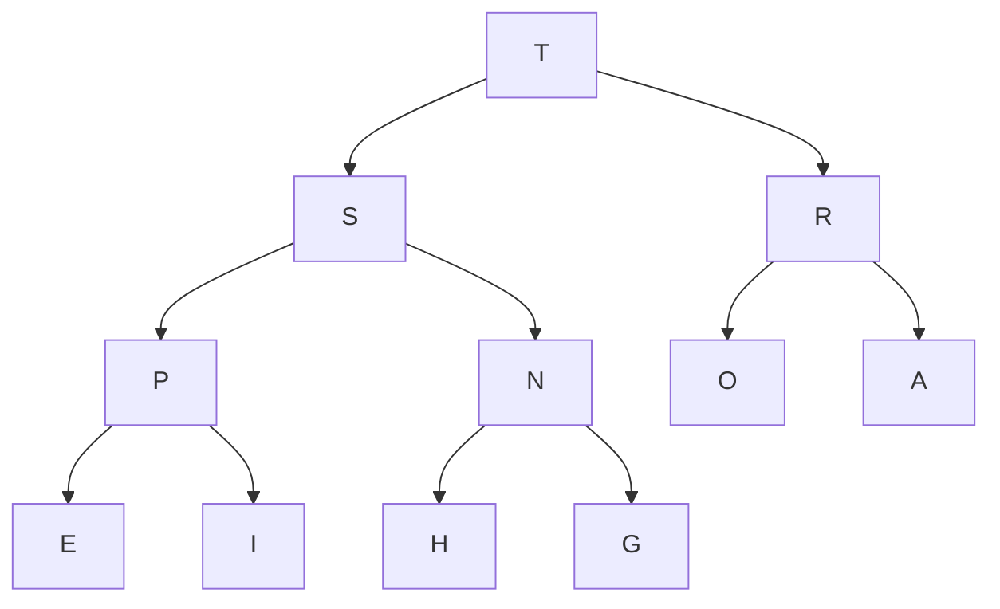

# (p)1 Fundamentals

## 重定向和管道

% java Average < data.txt

相当于:
data.txt -> standard input -> Average

% java RadomSeq 100 1 2 > data.txt

相当于:
RandomSeq -> standard output -> data.txt

% java RandomSeq 100 1 2 | java Average

相当于:
RandomSeq -> standard output -> standard input -> Average

## 递归(Recursion)

**递归三准则:**

* 递归有一个基准情形 (base case): 一个包含==return==的条件语句作为递归的第一条语句.
* 递归调用越来越处理 (adress) 更小的子问题 (subproblems) , 使递归调用慢慢的向基准情形 (base case) 靠拢.
* 递归调用间不能处理到重叠 (overlap) 的子问题.

违背这三条准则会导致不正确的结果或者极低的效率.

## 0. 二分查找

可以用for循环或者递归两种方法实现.

 O(logN)的时间复杂度
 
 源码见tk.dcmmc.fundamentals.Algorithms.BinarySearch.java

## 1. 欧几里德算法 (Euclid's Algorithm)

证明:
首先证明引理 gcd(a, b) = gcd(b, a mod b)
 假设 a = bq + r, 且a, b的最大公约数是d
1) d|a, d|b, 所以d|(a - bq), 即d|r, 所以d也是r的约数, 所以d是b, r的最大公约数.
2) 假设d是b和r的最大公约数, 即d|b, d|r, 所以d|(bq + r), 即d|a, 所以d是a, b的最大公约数.
证毕

由上面的引理不难递归出 gcd(a, b) = gcd(b, r1) = gcd(r1, r2) = ... = gcd(rn-1, rn) = gcd(rn, 0);
且b > r1 > r2 > ... > rn > 0 = rn+1, 以及rn-1能够被rn整除, 所以gcd(a, b) = gcd(rn-1, rn) = rn;

实现:
``` java
/**
	* Ex 1.1.25 
	* 欧几里德辗转相除求最大公约数
	* @param p nonzero int num.
	* @param q nonzero int num.
	* @return gcd of p and q.
	* @throws IllegalArgumentException p, q非0且|p| >= |q|.
	*/
int gcd(int p, int q) throws IllegalArgumentException {
		//取绝对值
		p = Math.abs(p);
		q = Math.abs(q);

		if (p < q || p == 0 || q == 0)
			throw new IllegalArgumentException("要求: p, q非0且|p| >= |q|\n但是, 参数p = " + p + ", q = " + q);

		if(p % q == 0)
			return q;
		else 
			return gcd(q, p % q);
	}
```

## ADTs(Abstract Data Types)

ADT是一种能对使用者(clients)隐藏数据表示的数据类型, 并且该类型跟很多的方法实现(APIs)相关联(就跟基本数据类型(`primitive data type`)和操作符(`operators`)相关联一样).

在OOP(Object-Oriented Programming)语言中常常把ADT封装(encapsulation)在一个类(class)中.
用APIs的实现来描述算法和数据结构.

把算法封装在ADT中, 能够在不影响client代码的同时为了提高性能更换算法.

ADT用法示例: [Github-Exercise 1.2](https://github.com/DCMMC/Java/blob/master/Algorithms/tk/dcmmc/fundamentals/Exercises/DataAbstraction.java)

## 背包(Bag)

Bag是一种只能添加元素不能删除元素, 可以元素迭代(比如使用foreach)的ADT.

## Queue (FIFO)

先进先出.

比如foreach的时候, 先进去的元素会被foreach先遍历到的.

## 2. Stack (LIFO)

后进先出.

一个简单应用: Dijkstra双栈算术表达式求值算法:

为了方便起见, 假设算术表达式只由数字, +, -, \*, /, sqrt, 括号和空格组成, 且没有省略任何括号(也就是暂时不考虑操作符的优先级), 数字和字符均以空白符相隔.
i.e., ( 1 + ( ( 2 + 3 ) \* ( 4 \* 5 ) ) )

然后对字符串从左往右解析并处理这些实体:
* 将操作数压入操作数栈
* 将运算符压入运算符栈(不包括括号)
* 忽略左括号
* 遇到右括号时, 弹出一个运算符, 弹出所需要数量的操作数, 并将运算符和操作数的运算结果压入操作数栈

## 实现方法

上述三种ADTs(Bags Stacks Queues) 都可以使用一下三种方式实现:
* fixed-capacity array 固定大小数组
* resizing-capacity array 可变大小的数组
* Linked List 链表

推荐使用SLL(Single Linked List)或者DLL(DoubleLinkedList)方式实现.

## 算法分析

### 算法分析常用函数

`!$\lfloor x \rfloor$` 向下取整, 不大于x的最大整数
`!$\lceil x \rceil $` 向上取整, 不小于x的最小整数
`!$\lg N$` 以2为底的对数(`!$\log _2{N}$`)
`!$H_N$`, i.e., `!$1+\frac {1} {2}+\frac {1} {3} +...+\frac {1} {N}$` 调和级数

### 算法分析常用近似函数

* `!$H_N$` ~ `!$\ln N$` (证明见高数无穷级数章节)
* `!$\sum N$` ~ `!$\frac {N^2} {2}$`
* `!$\lg N!$` ~ `!$N\lg N$`
* `!$(1-\frac {1} {x})^x$` ~ `!$\frac {1} {e}$` (见高数等价无穷小)
* `!$\dbinom {N} {k} = \frac {N!} {k! (N-k)!}$`(二项式系数, i.e., N取k的组合) ~ `!$\frac {N^k} {k!}$`

> **定义**:
> g(N) ~ f(N) 即 `!$\sum_ {N \rightarrow \infty} \frac {g(N)} {f(N)} = 1$`

计算loop的增长数量级:
e.g.
ThreeSum中的三重循环中
`!$\sum_ {i=1} ^N \sum_ {j=i+1} ^N \sum_ {k=j+1} ^N 1$` ~ `!$\int_{x=1} ^N \int_{y=x} ^N \int_{z=y} ^N \mathrm {d}z \mathrm {d}y \mathrm {d}x$` ~ `!$\frac 1 6 N^3$`


### 增长数量级(时间复杂度)
* 常数级别 1
* 对数级别 `!$\log N$` e.g. 二分查找
* 线性级别 N 
* 线性对数级别 `!$N \log N$` e.g. 归并查找(分治)
* 平方级别 `!$N^2$` 
* 立方级别 `!$N^3$`
* 指数级别 `!$2^N$` e.g. 穷举查找, 检查所以子集

### 倍率定理(近似模型)

如果T(N) ~ `!$aN^b\lg N$`(幂次法则的数学模型), 那么T(2N)/T(N) ~ `!$2^b$`
**Proof:** 
T(2N)/T(N) = `!$a(2N)^b\lg 2N$`/`!$aN^b\lg N$`
 = `!$2^b(1+ \frac {\lg 2} {\lg N})$`
 ~ `!$2^b$`
当N足够大的时候, 忽略就能很小了.

**推广:** T(kN)/T(N) ~ `!$2^k$`(k就是每次测试数据规模与上一次测试的数据规模的比值)

> **大O记法:**
> 如果`!$\exists c$`和`!$N_0$`, 使得对于所有`!$N > N_0$`都有`!$|f(N)| < cg(N)$`, 则称`!$f(N)$`为`!$O(g(N))$`

`!$O(g(N))$`也就是`!$g(N)$`为运行时间的**上限**.

> **大Omega记法**
>  如果`!$\exists c$`和`!$N_0$`, 使得对于所有`!$N > N_0$`都有`!$|f(N)| > cg(N)$`, 则称`!$f(N)$`为`!$\Omega (g(N))$`

`!$\Omega (g(N))$`, 那么也就是`!$g(N)$`为运行时间的**下限**.

> **大Theta记法**
> 如果`!$f(N)$`即是`!$O(g(N))$`又是`!$\Omega (g(N))$`, 那么称`!$f(N)$`为`!$\Theta (g(N))$`

大Theta记法用来描述算法的**最优性能**.


### 均摊分析(Amortized Analysis)

记录所有操作的总成本再除以总操作数.
这种情况可以允许少量开销很大的操作, 只要使平均开销小于预估上限就行.
典型的例子就是那个resizeing-Capacity array实现的Stack, 在触发resize指令的时候开销很大, 不过总的平均每操作的开销可以达到常数级别(即使在最坏的情况(worst-case)下).


### 内存开销

JDK在intel64 bits平台上的实现(不带引用/指针压缩的)是最小单位为8bytes(64bits), 也就是一个word.
例如一个一下代码创建的实例对象, 需要24bytes:
~~~ java
class ObjWithOneBoolean {
	boolean bool;
	String refObj;
}
~~~
* Object需要12~16bytes(64bits JDK实现, 32bits系统的JDK实现为8bytes)的head(或称overhead),  head中包含了这个object的Class对象的引用, 垃圾回收的信息, ID and status flags such as whether the object is currently reachable, currently synchronization-locked etc.(不过基本类型数组的head需要加上4bytes用来储存length)
* 基本类型存储区域: 一个boolean需要1byte
* 引用类型存储区域: 每个引用(pointer)大小的8bytes(64bits JDK实现, 32bits的实现就是4bytes的指针).
* 因为64bits系统最小内存单位都是8bytes, 为了使整个对象的大小为8(32bits系统的JDK实现就需要4的倍数)的倍数bytes, 最后还需要3bytes的padding用来对齐.

如果有成员内部类, 因为成员内部类需要一个指向外部类的开销:
e.g.
~~~ java
class ObjWithInnerClass {
	byte b; //1byte
	int i;//4bytes
	boolean bool;//1byte
	double d;//8bytes
	Objet objref;
	class Node { //8bytes, pointer to OuterClass
		int item;//4bits
		Node next;//8bytes
	}
}
~~~

内存结构:
* 12bytes的overhead
* d: 8bytes
* i: 4bytes
* bool: 1byte
* b: 1byte
* objref: 8bytes
* 用于Node指向外部的引用(extra head)
* item: 4bytes
* next: 8bytes
* padding: 6bytes

> hotSpot为了减少padding的占用, 会适当的调节这些变量和引用在内存中的相对位置, 所以他们的内存结构中的顺序并不会和代码声明的顺序相同.

> 可以通过[Java Object Layout](http://openjdk.java.net/projects/code-tools/jol/)查看内存占用详细情况

> 还可以直接使用java.lang.Instrument.getObjectSize()查看对象占用内存大小

[参考](http://pcpig.iteye.com/blog/1206902)
[Java对象内存占用分析](https://segmentfault.com/a/1190000006933272)

对于二维数组int\[5][6], 第一维度是一个存储有5个引用变量的对象, 然后为一个引用变量又指向一个存储了6个int的对象.

当一个方法被调用的时候, 系统会从栈内存中为方法分配所需的内存(用来保存局部变量), 当方法返回的时候, 内存会重新被返回栈内存.
当使用new创建对象时, 系统会从堆内存中为该对象分配所需的内存.

### 比较算法的一般步骤

* 实现并且调试这些算法
* 分析他们的基本性质(时间空间复杂度)
* 制定一个比较他们性能的猜想(假说)(可以基于某些定理)
* 进行实验来验证上述猜想

# 排序算法

## 3. 选择排序(Selection Sort)

时间复杂度不太取决于目标数组, 反正效率都不高

一次一次的找到每一轮的最小值并放到这一轮的第一个位置

~ 1/2N^2(固定这么多次) compare, ~ N(最差情况下) exchange

数据交换这一方面的开销小是优点, 总的效率低的缺点

## 4. 插入排序(Insertion Sort)

时间复杂度比较取决于目标数组, 目标数组越接近于完全正序, 时间复杂度就越低

交换的次数就是逆序数对的对数, 比较的次数就是交换的次数+(N-1)

平均情况下(这里取的是每一个item都是进行到一半就找到了位置), 比较 ~ 1/4N^2, 交换 ~ 1/4N^2

在最坏情况(完全倒序), 比较 ~ 1/2N^2, 交换 ~ 1/2N^2

最好情况(完全正序), 比较 ~ N-1, 交换 0

## 5. 希尔排序(Shell Sort)

在最糟糕的情况下时间复杂度为O(N^1.5), 一个小小的改进就能从InsertionSort的O(N^2)降低到O(N^1.5)(而且是最坏情况)

平均下的时间复杂度不确定, 取决于increment sequence的选取.

InsertionSort在每一轮插入的时候需要跟相邻的元素一个一个交换, 这样很消耗资源, 希尔排序作为插入排序的扩展,

每次比较并交换的间隔不再是1(h=1这一特殊情况下h-sorting就是InsertionSort), 而是大于1的不同的步长.

**定义(Def.): h-sorting**

> 如果数组中的元素任意间隔h都是有序的, 那就称为h-sorting array, e.g., `1 2 3 4 5 6 7`, 取h为2, 则子序列1 3 5 7和子序列2 4 6分别都是有序的(即有h个互相独立有序的子序列交错组合在一起), 则该数组是h-sorted array
> 
> h-sorting即以h为间隔对子序列进行排序, e.g., 对序列` 1 5 8 2 3 4 6 7 6 8 9 `(共11个元素), 以h = 3进行h-sorting,
> 首先这个序列拆分为一下3个子序列: `1 2 6 7`和`5 3 7 9`和`8 6 4`, 然后依次对这三个子序列进行InsertionSort, 得到`1 2 6 7, 3 5 7 9`和`4 6 8`这三个子序列, 合并之后为: `1 3 4 2 5 6 6 7 8 7 9`, 这个序列就被称为原序列以h=3的h-sorted array
> 
> 一个更好的理解就是把序列放在一个h列的表中, 然后对其形成的二维表的每一列进行InsertionSort:
> 
> 1 5 8 2 3 4 6 7 6 8 9以h=3:
> 
> 5 8 
> 2 3 4
> 6 7 6
> 8 9
> 
> 然后依次对第一第二第三第四列进行InsertionSort:
> 
> 1 3 4
> 2 5 6
> 6 7 8
> 7 9


ShellSort大体的原理是以一系列值(increment sequence)作为h(又叫步长), 由大的h到小的h来对序列进行h-sorting, 只要该h序列最后的h是1,
就一定能得出排序好的序列, 比如 5 3 1就是一个h序列, 先以h=5对原序列进行h-sorting, 然后再以h=3进行h-sorting, 最后以h=1进行h-sorting.
不过从１开始然后不断乘以２这样的序列的效率很低，因为１后面都是偶数，彼此ｈ-sorting排序都是错开的的.

而公认的最好步长序列是由Sedgewick(本书作者)提出的`(1, 5, 19, 41, 109,...)`，该序列的项来自`!$9 \times 4^i - 9 \times 2^i + 1$` 和`!$2^{i + 2} \times (2^{i + 2} - 3) + 1$` 这两个算式合并起来的结果.
用这样步长序列的希尔排序比插入排序要快，甚至在小数组中比快速排序和堆排序还快，但是在涉及大量数据时希尔排序还是比快速排序慢。

另一个在大数组中表现优异的步长序列是（斐波那契数列除去0和1将剩余的数以黄金分区比的两倍的幂进行运算得到的数列）

不过一般使用的序列是 ==Knuth== 提出的由递推公式 `!$h = h \times 3 + 1$` 确定的数列(转成通项公式即为`!$\frac {1} {2} (3^k - 1)$`, 这个序列在元素数量比较大的时候,
相比于 ==SelectionSort== 和 ==InsertionSort== , 性能按照数组大小以2的次幂递增.
使用 ==Knuth== 提出序列的比较次数大概为N的若干倍再乘以这个序列的长度(差不多约为`!$N^{1.5}$`, 由大量N很大的实验可以估算出)

虽然使用最优的序列的时候, 在对小数组排序性能有时候可以超过 ==heapsort== 和 ==quicksort== , 不过在大量数据的时候还是慢于后两个, 不过相比于
后两者复杂一些的实现, ==ShellSort== 只需少量代码而且对资源的消耗也比较小, 所以适合用在嵌入式系统这些比较重视资源的场景中.

## 6. 归并排序(MergeSort)

核心是归并: 把两个已排序的子序列归并成一个已经排序的序列.

Top-down mergesort:

采用递归和**分治思想**把一个序列不断的二分, 直到子序列只有一个数值, 这样一个数的子序列肯定是排序好的, 然后直接开始不断归并.

Bottom-up mergesort:

采用自底向上的方法非递归的归并排序数组

先把整个数组分为最小的情况(也就是每个子数组长度为1), 先这样进行归并, 然后按照数组长度为2进行归并, 子数组长度每次都是上一轮归并的子数组的长度的两倍. 直到能够归并整个数组.

每一轮最多需要N次比较, 并且需要logN轮, 所以总的时间复杂度为NlogN.

总的空间复杂度为O(logN), 因为这是一个递归程序, 并且总有logN层递归, 每一次递归的返回值都要保存在Stack中, 所以需要O(logN)的空间消耗.

Bottom-up mergesort可用于原地排序LinkedList.

### **分治思想**

把一个复杂的问题不断分成很多小的子问题, 首先解决这些子问题, 然后用这些子问题的结果去结果整个问题. 分治思想常常涉及到递归. 

**对于一个大小为N的数组, 采用自顶向下(top-down)的mergesort的方法进行排序, 比较次数在 `!$\left[ \frac {1} {2} N \lg N, \ N \lg N\right]$`**

**Proof.**

定义函数 `!$C(N)$` 表示排序一个长度为N的数组的比较次数, 显然: `!$C(0) = C(1) = 0$`, 
而且对于 `!$N > 0$`, 在递归方法 mergeSort() 中, 有此上界:

```mathjax!
$$C(N) \leq C\left( \lfloor \frac {N} {2} \rfloor \right) + C\left( \lceil \frac {N} {2} \rceil \right) + N $$
```

最后一个N表示merge花费的最多比较次数.

并且同时有此下界:

```mathjax!
$$C(N) \ge C\left( \lfloor \frac {N} {2} \rfloor \right) + C\left( \lceil \frac {N} {2} \rceil \right) + \lfloor \frac {N} {2} \rfloor $$
```
 `!$\lfloor \frac {N} {2} \rfloor$` 表示merge所花费的最少比较次数, 正好就是两个子序列直接合在一起(前后两部分反着合起来运算)就是完全有序的了, merge还是需要花费一半的比较次数来比较前半部分, 到了i > mid或者j > hi的时候, 就不需要比较了.
 
 为了方便计算, 这里假设 `!$N = 2^n , \ \therefore \lfloor \frac {N} {2} \rfloor = \lceil \frac {N} {2} \rceil = 2^{n - 1}$`
 
 于是上界:
 `!$ C(N) = C(2^n) = 2C(2^{n - 1}) + 2^n$`
 
 左右同除以 `!$2^n$`, 得到:
 
 
 `!$ \frac  {C(2^n)} {2^n} = \frac {C(2^{n - 1})} {2^{n - 1}} + 1$`, 这是一个等差数列, 
 
 易得: `!$\frac {C(2^n)} {2^n} = \frac {C(2^0)} {2^0} + n, \Rightarrow C(N) = C(2^n)  = n2^n = N \log N $`
 
 另外一个证明方法为:
 
 mergeSort采用递归和分治思想, 把整个序列分为了 在二叉树的kth level, 共有`!$2^k$`个merge调用, 而且每个merge调用都需要最多比较`!$2^{n - k}$`次, 所以在每一个level都需要`!$2^k \cdot 2^{n - k} = 2^n$`次比较, 所以对于有n个level的二叉树状mergeSort中, 共需要`!$n2^n$`次比较, 又对于N个结点的二叉树, 其深度为`!$\log_2 N$`, 所以总共的最多比较次数为`!$N \log N$`.
 
 **Top-down 和 Bottom-up mergesort 最多需要 6NlogN次数组访问**
 
 **Proof.**
 
 每一次merge最多访问数组6N次: 2N次用于数组访问, 2N次用于移动回去, 还有最多2N用于比较.
 
 **所以MergeSort的平均时间复杂度为O(N logN), 空间复杂度为O(N)**
 
 ### **优化**
 
 * 对于较小的子序列, 使用InsertionSort会比默认的merge更加的高效(能够提高10%-15%),  see Exercise 2.2.23.
 * 在merge()中添加对a[mid] <= a[mid + 1]的情况的校验, 如果a[mid] <= a[mid + 1], 那么就不进行归并, 这样能够在处理完全有序的序列时达到线性时间复杂度, see Exercise 2.2.8
 * 消除暂存数组的复制操作: 每一次merge都要对子序列进行复制, 这样会造成复制数据的时间开销(空间开销不变), 设计两次sort()调用, 一次从数组中取出那些数据, 然后将归并好的结果放入暂存数组中, 另外一次就从暂存数组中取出数据然后将归并好的结果放入原数组, 这样两个数组同时工作在递归中, 减少复制的开销. 这需要一定的递归技巧. see Ex 2.2.11

> P.S. 不是说一定要每次都实现这些所有的优化, 而是我们应当注意: 不要对一个算法的初始性能下绝对的结论, 很多时候还有很多优化的空间.

研究一个新问题的时候, 最好的方法是先用最简单的方法实现, 然后在这个方法成为瓶颈的时候再去重新实现一个新的算法. 实现那些仅仅带来参数因子的优化可能并不值得, 并且在每次优化之后最好一定要进行科学的实验(就像书上的练习一样).

### **Computational Complexity of MergeSort**

**所有的基于比较的排序算法的在最坏情况下的比较次数的下界(low bounds)为 log(N!)~N logN(see P185 Stirling's approximation: log(N!) = log1 + log2 + ... + logN ~ NlogN)**

**Proof.**

构造一个适用于所有compare-based sorting algorithms的**二叉决策树(decision tree)**, 在compare-based sorting algorithms中, 树中的每一个 **内部结点(internal node)** 表示一次比较, 每一片 **叶子(leaf)** 表示完整排序后的序列.

显然, 对于长度为N的序列, 叶子的最少个数为N!, 即有N!中不同的排列可能. 否则如果少于N!, 说明有一些排列的可能会被遗漏, 不过可以多于N!, 因为有可能出现重复的叶子.

从root到某一个leaf之间的路径上结点的个数即为这种情况下比较的次数, 最长的那一条路径叫做树的**高度**, 它代表最坏情况下的比较次数.

又显然, 一棵高度为h的二叉树, 最多有`!$2^h$`片叶子(当且仅当为**完全二叉平衡树**的时候).

综上所述, 高度为h的二叉决策树的叶子的数量在 `!$\left[ N!, \ 2^h\right]$`区间内.

所以比较次数至少为 `!$\log (N!)$` ( ~ `!$N \log N$`)次.

> P.S. 如果算法会对某些特殊顺序的序列进行优化或者算法能够了解到序列的值的分布或者序列的初始顺序或者有重复key之类的情况, 上述下界将不再适用.

除了在最坏情况下的比较次数的下界已经是确定的了, 还有很多因素需要关注: 空间占用, 一般情况下的时间复杂度, 不基于比较的排序算法, 数组访问次数等等.

## 7. Knuth(Fisher-Yates) shuffle算法

原地(in-place)随机打乱一个数组, 并且是等概率的随机排列数组, 时间O(n), 空间O(1).

算法实现见: tk.dcmmc.sorting.Algorithms.ArrayShuffle.java.

**Proof.**

要使第`!$k(1 \leq k \leq N)$`个元素被交换在第`!$i(1 \leq i \leq N)$`个元素的位置上, 即如下两种情况:

* 如果k < i, 前i - 1轮交换都不可能把k交换到i的位置, 所以不用管, 然后第i轮交换一定要保证k交换到了i的位置, 也就是`!$\frac {1} {i - 1}$`的概率, 然后还要保证i + 1 ... n轮都没有把k从i的位置上被交换到其他位置. 
* 如果i <= k, 前k - 1轮交换都不需要管, 第k轮交换一定要确保i被交换到了k的位置上, 即`!$\frac {1} {k - 1}$`, 然后还要确保k + 1...n轮交换都没有把i从k的位置上被交换到别的位置.

以第二种情况为例计算其概率:

```mathjax!
$$P_{i \to k} = \frac {1} {k - 1} \cdot \frac {k - 1} {k} \cdot \frac {k} {k + 1} \cdot \cdot \cdot \frac {n - 1} {n} = \frac {1} {n}$$
```

证毕.

## 8. Quicksort

QuickSort也是一种**分治思想**在排序中的应用的算法. 

而且QuickSort和MergeSort是相互补充的, 和MergeSort的递归方式有所不同, MergeSort是先折半(half)递归然后再归并(merge), QuickSort是先分区(Partition)再递归分支(不一定是折半, 取决于分区的时候找到的位置).

优点: 实现比较简单, 相当少的数据移动次数, 每一轮的比较次数都是固定的N + 1, 时间复杂度和空间复杂度都相当优秀

缺点: 很多小的细节容易导致严重的性能损失, 有时候甚至达到了N^2的时间复杂度; 而且在partition树不平衡的时候超级低效, 比如第一个partition item是最小的数, 然后就只会交换移动一个顺序, 造成在大数组中调用过度的partition次数.

**原地分区(In-place Partition)**

把目标范围中的第一个元素a[lo]放在指定的位置: 左边的subarray的所有元素都小于等于a[lo], 右边subarray的所有元素都大于等于a[lo], 然后把a[lo]换到这个位置来.

基本策略:

i, j这两个下标分别从要分区的范围的下界和上界开始, 逐渐向中心递推, 知道遇到a[i]大于(等于)a[lo], a[j]小于(等于)a[lo],
这时候如果i < j(也就是没有交叉), 就将a[i]和a[j]交换, 知道没有可以交换的, 这时候j的位置就是a[lo]的最终位置.

 一些坑:
 
1. 这里采用的是原地排序, 如果使用额外的数组会更加容易实现, 不过这中间产生的复制数组的时间消耗会非常大.
2. 两个inner loop都有边界检查, 防止出现partition是数组中的最大或者最小值倒是超出范围的情况.
3. 保持随机性: 对于程序运行时间的可预测性至关重要, 相当于每一次都是随机得对待子数组中的所有元素, 另外一个方法是在partition()中随机的选取partition item来保持随机性. 保持随机性是为了防止partition树极度不平衡的情况, 也就是像上文中的缺点所指出的那种情况, 避免产生过多的partition次数, 至少要避免连续产生这种糟糕的partition.
4. 避免死循环, 控制loop的出口(i >= j), 很多时候因为subarray中有与partition item相同的值的元素造成死循环.
5. 处理好subarray中的与partition item相同的值的元素, inner loop的条件一定不能是 <=, 因为在遇到大量与partition item相同值的元素的情况, 例如所有元素都是一样的值, 这时候两轮inner都会该死的遍历所有元素, 并且j还tm就是l这样效率爆炸般得达到了N^2, 如果元素再多一点(>2.5w个), 就直接爆栈了. 如果是<而不是<=的话, 就算遇到这种情况, j也是(lo + hi) / 2的样子, 有种二分的感觉,虽然exch()的调用看起来有点冗余, 不过至少比爆栈好... 见到Ex 2.3.11
6. 注意递归边界

**算法分析:**

在最理想情况, 每一次j都是正好在subarray的中间位置, 也就是每次都能二分, 这样和mergesort一模一样, 时间复杂度为 ~ NlogN

**Quicksort排序N个不同的数字平均使用 ~ 2NlogN (`!$\dot {=} 1.39N \log N$`)的比较次数(以及1/6的的交换)**

**Prooof.**

设`!$C_N$`为排序N个(分散的)items所需要的平均比较次数, 易得`!$C_0 = C_1 = 0$`, 而且对于`!$N > 1$`, 有一下递归关系:

```mathjax!
$$C_N = N + 1 + \frac {\left(C_0 + C_1 + \cdot \cdot \cdot + C_{N - 2} + C_{N - 1} \right)} {N} +  \frac {\left(C_{N - 1} + C_{N - 2} + \cdot \cdot \cdot + C_{1} + C_{0} \right)} {N}$$
```

N + 1是每一轮排序的固定比较次数, 第二部分是排序left subarray的平均比较次数, 第三部分是排序right subarray的平均比较次数.

又将`!$C_N$`与`!$C_{N - 1}$`两式相减, 得到`!$NC_N = 2N + (N + 1)C_{N - 1}$`, 左右同除以N(N + 1), 得到 `!$\frac {C_N} {N + 1} = \frac {2} {N + 1} + \frac {C_{N - 1}} {N}$`, 令`!$\lambda_N =  \frac {C_N} {N + 1}$`, 所以递推得到

`!$C_N = 2(N + 1) \cdot \left( \sum_{i = 3}^{N + 1} \frac {1} {i} \right)$` ~ `!$2N\ln N$`

证毕.

> 交换次数的证法与上面类似不过更加复杂.

> 对于有重复数值的情况, 准确的分析复杂很多, 不过不难表明平均比较次数不大于`!$C_N$`, 后面将会有对这种情况的优化.


**Quicksort在最坏情况下花费 ~ `!$\frac {N^2} {2}$`的比较次数, 不过随机打乱数组将会极大的避免这种情况**

**Proof.**

最坏情况: 第一次partition的时候的partition item就是最小的那个值, 然后每一次右边partition都是把上次partition右边的元素全部遍历一次, 所以所花费的比较次数为:

```mathjax!
$$N + (N - 1) + \cdot \cdot \cdot + 2 + 1 = \frac {N(N + 1)} {2}$$
```
证毕.

这种情况下不仅是时间消耗为 ~ N^2, 而且递归调用的空间消耗也是线性的, 这样在处理大数组时就很容易发生爆栈.

不过值得一提的是, 发生这种情况的几率是相当小的(Ex 2.3.10), 可以安全的忽略.


**In Summary**
虽然Quicksort在一般情况下的比较次数(1.39N logN)大于mergesort()(1/2N logN ~ N logN), 不过Quicksort数据移动的次数相当少, 所以相对来说Quicksort会更加快.

### **优化**

这些优化大概能带来20%~30%的性能提升.

1. Cutoff to Insertion Sort (Ex 2.3.25)

因为Quicksort在处理小数组的时候速度还没有InsertionSort快, 所以可以通过cutoff来把小的数组用InsertionSort来处理.

2. Median-of-three partitioning (Ex 2.3.18 && Ex 2.3.19)

选取subarray中间三个元素作为partition item, 这会带来些许性能提升, 而且不需要做数组边界检查了.

3. Entropy-optimal sorting

在实际使用中, 数组中往往会有大量的重复keys, 比如subarra中所有元素都是一样的key的时候, 并不需要再把他们给partition成更加小的subarrays了, 不过原始版本的Quicksort还是会把他们给partition, 这时候可以把linearithmic-time优化到linear-time.

一个简单的方法是使用**3-way partitioning**, 这是由Dijkstra的**Dutch National Flag**问题推广出来的.

相比于原来的2-way partitioning, 2-way partitioning把array分为三个部分: 小于 等于 大于 partition item的三个部分.

**Dijkstra法:**

维持两个指针 **lt** 和 **gt**, **a[lo...lt - 1]** 为 **小于** partition item(简称**v**)的部分, **a[lt...i - 1]** 为 **等于** v的部分, **a[i...gt]** 为还没有处理的元素, **a[gt + 1...hi]** 为 **大于** v的部分. 

处理过程: 
从i = lo开始

* 如果a[i]小于v, 交换a[lt]和a[i], 然后lt++, i++
* 如果a[i]大于v, 交换a[i]和a[gt], 然后gt--
* 如果a[i]等于v, i++

所有遇到的元素除了等于v, 都会进行交换, 所以3-way交换次数要多于2-way, 在处理重复元素比较少的时候, 会产生较大的性能损失, 直到1990s的时候有人提出了更好的实现方法(Ex 2.3.22), 使得优化版本的3-way partition Quicksort在处理包含很多重复元素的实际应用比mergesort和其他排序算法都要快很多, 甚至突破了原来在mergesort中证明过的那个下界.

对于有固定个数个不同的key的数组(也就是有重复数值的数组), MergeSort为N logN的时间, 而用3-way partitioning实现的Quicksort则可以达到线性时间, 保守估计其上界为不同主键的个数乘以N的时间复杂度.

**没有任何(有可能有重复数值的)的基于比较的排序算法能够保证使用少于`!$NH - N$`比较排列含有k个不同数值的N个items, 其中H为Shannon Entropy: `!$H = - \sum_{i = 1}^{k} p_i \log p_i$`, `!$p_i$`为这k个不同数值的第i个数值在数组的个数除以整个数组的元素个数**

**Proof sketch**

对于有k(k <= N)个不同的数值的N个items的数组, 产生的不同的全排序为`!$\frac {N!} {\prod_{i = 1}^{k} x_i!}$`种(高中知识), 也就是在基于比较的排序的二叉决策树中最少应该有`!$\frac {N!} {\prod_{i = 1}^{k} x_i!}$`(`!$x_i$`为k个不同的数值中的第i个在整个数组中的个数)片叶子(可参见MergeSort中相关证明过程), 所以需要的比较次数为

```mathjax!
$$\log \left( \frac {N!} {\prod_{i = 1}^{k} x_i! } \right)$$
$$= \log N! - \sum_{i = 1}^{k} x_i!$$
$$\simeq N \log N - N \sum_{i = 1}^{k} \left( \frac {x_i} {N} \log x_i \right)$$
$$= N \log N  - \sum_{i = 1}^{k} \log N - N \sum_{i = 1}^{k} \left( \frac {x_i} {N} \log \frac {x_i} {N} \right)$$
$$= N \log N  - N \cdot k \log N + N H$$
$$= N H + N \cdot ( 1 - k ) \log N$$
$$\simeq N H - N$$
```

**Quicksort with 3-way partitioning 使用 ~ (2 ln2) N H次比较来排序N items, 其中H是Shannon entropy**

**Pf. sketch**

通过Quicksort在N个数值全不相同的时候的平均比较次数的证明一般化到有重复数值的情况可以得出上述结论, 不过**证明过程较为复杂**(B. Sedgewick 在1990s证明过).

这比较次数比上个结论中的最理想情况需要多花费39%的比较次数, 不过还是术语常数因子的范围内.

> 注意当所有的keys都不相等时, H = logN(也就是`!$\forall i \in [1, N], p_i = \frac {1} {N}$`)

> 当数组中含有大量的重复数值的时候, Quicksort with 3-way partitioning能够把linearithmic time优化到linear time

## 9. Priority Queue

### **基本实现**

思路:

1. lazy approach(unordered): 类似于用resizing-array实现的pushdown stack, 每一次insert操作跟stack的push一样, 时间O(1), 然后在remove the maximum操作的时候, 用类似于selection sort的inner loop的思路来把最大的元素交换到数组的结尾, 然后pop出来, 时间O(n).
2. eager approach(ordered): insert的时候把右边的这个较大的元素移动一个位置来使当前操作的key放在正确的位置上(类似与InsertionSort), 时间O(n), 然后remove the maximum的时候直接把最右边的key返回并删除就好了.
3. 使用Linked List, 又该pop或者push方法来实现(按照上面的思路), 时间消耗也是一样的, 反正一个是O(1)一个是O(n).


**Def. `heap-order` 的 binary tree**

每一个node都要大于等于它的(两个) children node. 同样地, 每一个node都要小于等于它的parent node. 这样便可以保证: Moving up from any node, we get a nondecreasing sequence of keys; moving down from any node, we get a nonincreasing sequences of keys.

显然, 在heap-ordered binary tree中最大的key就是root node.

**Def. binary heap**

binary heap就是一组在完全heap-ordered binary tree(**也就是假设这棵tree有n level, 从 1 到 (n - 1) level都是满的**)中的元素, 并在数组中按照层次进行存储(不存储第一个元素), 也就是从底层到顶层, 一层一层从左到右把node中的key存储在数组中(好像是前序遍历吧).

简略理解就是: **Complete binary tree represented as array**

e.g.

i     | 0 | 1 | 2 |  3 |  4 | 5 |  6 |  7 |  8 | 9 | 10 | 11
--|--|--|--|--|--|--|--|--|--|--|--|--
a[i] | - | T | S | R | P | N | O | A | E | I | H | G 

表示:



其中数组的1 ~ 1表示level 1, 2 ~ 3表示level 2, 4 ~ 7表示level 3, 8 ~ 11表示level 4.

**对于完全heap-ordered binary tree(也就是假设这棵tree有n level, 从 1 到 (n - 1) level都是满的), 它对应的binary heap在数组中的表示正好有: index为k的node的父结点的index就是`!$\lfloor \frac {k} {2} \rfloor$`, 它的两个子结点的index分别为`!$2k$`和`!$2k + 1$`.**

**Pf. 易证, 从略**

**一颗大小为N的Complete binary tree的大小为`!$\lfloor \lg N \rfloor$`**

**Pf. 可以通过数学归纳证明**

**heap order被破坏需要reheapifying(aka restoring heap order)的两种基本情况:**

* 有一些node的优先级是递增的, 也就是子结点的优先级大于父节点的情况, 比如有一个新的node添加到了binary heap的末尾, 这时候就需要向上遍历来进行reheapifying.
* 有一些node的优先级的递减的, 比如把一个结点替换成另外一个更加小的值之后, 这时候就需要向下遍历来进行reheapifying.

**Bottom-up reheapifying (swim)**

就像上述第一种情况, 有一些node的key比其父节点还大, 这时候就需要与父节点交换位置, 这时候这个node下面的两个子节点都肯定要小于等于这个node, 然后再与新位置上的父节点进行比较, 直到其父节点大于等于这个node, 或者是已经到了root了. 这个过程就像一个拥有较大的值的node游到了heap中的更高的level去了, 所以命名为swim.

**Top-down reheapifying (sink)**

就像上述第二种情况, 如果heap order因为有些node的key比其一个或者两个子节点的key都要小的话, 就通过不断与其较大的子节点进行交换直到两个子节点的key都要小于等于该node, 或者是已经到了heap的bottom. 这个过程就像一个拥有较小的值的node下沉了heap中的更低的level去了, 所以命名为sink.

所以Priority Queue的两个操作可以这样实现:

**Insert**

将新的key添加在数组的最后面, 然后向上遍历heap(siwm), 进行reheapifying.

**Remove the maximum**

把数组第一个元素取出来, 然后把最后一个元素放到第一个元素的位置上, 然后进行sink.

**在一个N-key的priority queue中, insert最多需要1 + logN次比较, remove the maximum最多需要2logN次比较**

**Pf.**

由前面的定理可以知道, heap-ordered Complete binary tree的高度为floor(logN), insert显然需要最多1 + logN次比较, 而remove the maximum因为每次都要先比较两个子节点找出大的还要跟要操作的node比较来判断是否需要交换, 所以remove the maximum需要最多2logN次比较.

### **Multiway heaps**

很容易将heap-ordered complete binary tree推广到heap-ordered complete ternary tree(三叉树), 这样index为k那个node的父节点的index就是`!$\lfloor \frac {k + 1} {3} \rfloor$`, 它的三个子节点的index分别为 3k - 1, 3k + 1. 同样的, 很容易推广到d-ary heap(也就是d叉树), 这里有一个因为树的高度减少带来的遍历开销的减少和在一个结点的所有子节点中找到最大的那个节点的开销的增加之间的权衡, 这个权衡取决于具体实现和两种操作的使用频次的比例.

**Array resizing**

可以在insert()和delMax()中分别实现把数组长度加倍和使数组长度减半的代码, 就像1.3中的例子那样.

**keys的不可变性**

PQ在以数组为参数的构造器创建对象之后, 将会在操作PQ的时候假设目标数组并没有被客户端程序员更改, 因为要开发一个这样的机制来确保客户端程序员的更改及时同步会提高代码的复杂度并且会降低效率.

**Index priority queue**

在很多应用场景中，允许客户端程序员引用已经存在与Priority Queue中的元素是有必要的。

### **Heap Sort**

用binary heap这一数据结构并使用 `sink()` 和 `swim()` 来实现的快速排序算法, 其特点是空间消耗特少(O(1)), 因为是原地排序, 时间消耗也很优秀(O(N logN))

时间O(NlogN)(最坏情况下的比较次数为~ 2NlogN), 空间O(1), 这是唯一一个时间和空间都比较optimal的排序算法, 不过每次比较都很难是比较数组中相邻的位置上的元素, 这会导致较低的cache performance, 低于mergesort, quicksort甚至shellsort, 因为后面这些都能保证大多数情况都是比较临近的元素. 不过HeapSort是in-place的, 空间消耗极小而且代码量少, 可以适用于嵌入式系统和老式手机...

Floyd改进了Sortdown中过多的比较次数(使之与mergesort相近), 对某些性能比较依赖比较时间的情况有帮助(比如String的比较, 比较耗费时间)

**Heapsort**主要分两个阶段:

**Heap construction**

* 可以从第二个元素开始, 从左往右进行swim, 当前指针之前的元素就是heap-ordered的了, 后面的元素是待构造的元素, 指针到最后一个元素的时候, 整个数组就是heap-ordered的了, 时间消耗O(NlogN)

* 一个更加高效的方法是从右往左进行sink, 从数组的floor(N/2)位置开始(N对应的是heap的最后一个元素, 而N/2代表最后一个元素的父节点,这个结点也就是最后一个拥有子节点的结点了, 后面的结点都是最后一个level的)进行sink, 最开始这几个sink相当于reheapifying三个元素的subheap, 然后逐渐reheapifying 7个元素的heaps... (结合heap的树形表示), 这样sink最后一个元素相当于reheapifying整个数组代表的tree, 这时候就已经是heap-ordered的了. sink-based heap construction在最坏情况下的交换次数为N, 比较次数为2N(因为每次sink调用要比较两次), 这个可以通过heap的树形图来理解, N个元素的heap的binary tree的`!$\lfloor \log N \rfloor + 1$`层, N/2这个位置是在倒数第二层(也就是`!$\lfloor \log N \rfloor$`层的最后一个有子结点的结点, 简称为k层), 然后最多有`!$2^k$`个有三个元素的subheap需要sink(也就是最后一层全满的情况下), 遍历完这些最多3个元素的subheap之后需要遍历`!$2^{k - 1}$`个最多7个元素的subheap(也就是三层的树), ... 一直到最后sink整个树, 加入每次都需要交换, 则最多需要`!$2^{k - 1} \sum_{i = 0}^{i = k - 1} \frac {i + 1} {2^i} \dot{=} N$`(交错相减法求和)
例如一个127个元素的heap, 需要sink 32个大小为3的subheaps, 16个大小为7的subheaps, 8个大小为15的subheaps, 4个大小为31的subheaps, 2个大小为63的subheaps, 一个大小为127的heap, 最坏情况下的交换次数就是32\*1 + 16\*2 + 8\*3 + 4\*4 + 2\*5 + 1\*5 = 120.


**Sortdown**

因为Heap construction之后数组中的元素是按照heap binary tree的顺序存储的, 所以为了调整为由小到大的顺序, 需要将前面的较大的元素移动到数组的后面去, 第一次把第一个元素(也就是最大的元素)和最后一个元素交换, 这样pq[N]就是最大的元素了, 然后再sink(1, N - 1)把最后一个元素(这叫已排序的部分)之前的元素重新reheapifying, 然后在把第一个元素和第N - 1个元素交换... 这样就可以使整个数组变成由小到大的顺序了, 按照前面证明的sink的比较次数为2logN, 可以得到Sortdown的比较次数为2NlogN.

Flody's method:

先一直跟两个children中较大的那一个交换直到到了heap的底部(也就是不考虑是否会比那个较大的要小), 然后再从sink结束的那个位置(也就是path的尽头了)往上swim, 这样就可以把sink的比较次数减半...
这个优化只有在元素比较的时候比较耗时的情况(比如String的比较)就会提高算法效率, 但是会造成比heapsort origin还严重的cache missed以及更多的branch mispredictions (不利于Complier的优化).

## Applications

### Pointer Sorting

process references (as pointers in C/C++) to items rather than objects themselves. 

* 键值只读性, 对于引用(指针)排序, 如果排序完成之后客户端更改了object里面的值, 这样的话就会破坏顺序性. 所以像 ==String==, ==Integer==, ==File== 这些类都是值不变( **Immutable** )的.
* 交换的开销比较小, 因为是引用, 只需要把指针交换, 而不是把对象整体给交换, 所以开销是比较小的

### Stability 稳定性

对于Items with multiple keys, 可以对不同种类的Keys采取不同的排序方法, 假设需要对一个本来按照某种Key排序好的数组, 重新按照另外一种Key来排序, 如果采用的排序算法是Stability的, 则排序之后, 对于相同的值的Key的Items, 还是按照原来那种Key排序好的顺序, 这样就对于这两种Key都保持的有序; 如果排序算法是unstability的, 就会产生按照现在这种Key相等的那些Item按照原来那种Key是无序的.

不过可以通过一些技巧(trick)来把所有的排序算法都变成 stable behavior. (Ex 2.5.18, 原理应该就是对那些Values相等的Item按照原来那种排序方式再排序一遍)

不过如果稳定性是基本要求的话, 还是直接用 stable的排序算法更加好.

**几种常见排序算法的比较**

algorithms | stable? | in place? | running time | extra space
----|-----|-----|------|------|------
selection sort | no | yes | N^2 | 1
insertion sort | yes | yes | N ~ N^2 | 1
shellsort | no | yes | N logN ~ N^(6/5) ? | 1
quicksort | no | yes | NlogN | lgN
3-way quicksort | no | yes | N ~ NlogN | lgN
mergesort | yes | no | N logN | N
headsort | no | yes | NlogN | 1

> Quicksort 是最快的 general-purpose sort:
> QuickSort是 O(NlogN) 而且其系数很小, 并且inner loop里面很少指令, 并且 cache 使用率好, 都是连续的读取内存.
> 不过QuickSort不是稳定的排序方式

### Java System Sorting

现在的JDK实现(JDK8)已经更换为了 TimeSort(一种混合排序, 能够针对不用分布的数组有针对的采取最优的排序算法).

差不多的思路就是: 针对基本类型, 因为基本类型不会存在 Items with multiple Keys的情况, 所以不用考虑稳定性, 而对于引用类型, 会使用mergesort等稳定的排序算法
