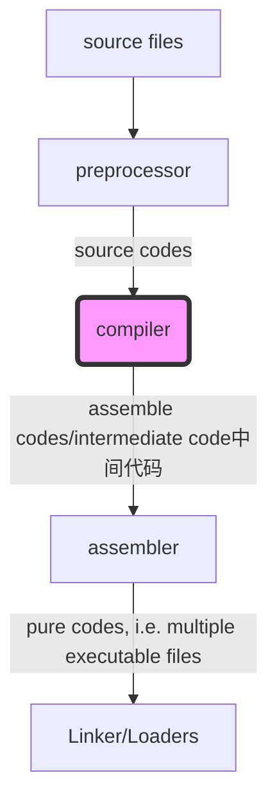
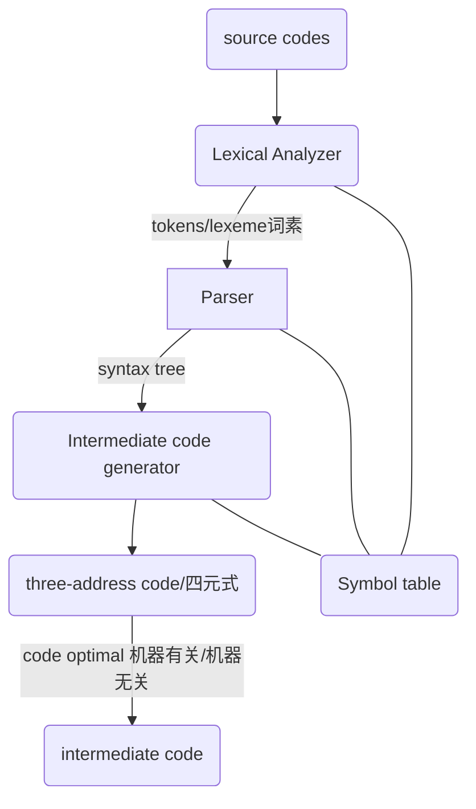

# 编译原理

## Reference

*Compilers - Principles Techniques and Tools 2nd*

## (p) 1. Compiler Intro.

**a skectch process of source code become executable file**

> source code to intermediate code is ==compiler front end==, intermediate code to executable file is ==compiler back-end==

e.g. clang use ==IR== as intermediate, all C-family languages(such as C, C++, Object-C) will compiler to ==IR==.

**More detials of compiler**

> token/lexeme always represented as tuple '<token-type, attribute-value>'.

## (p) 1. Grammer

**Chomsky hierarchy** of ==formal grammer==

### **Type-0 grammer, i.e., Unrestricted grammar**

### **Type-1 grammer, i.e., Context-sensitive grammar**

### **Type-2 grammer, i.e., context-free grammer**

==`!$V_N \rightarrow $`==

## (p) 2. Lexical Analyzer

## (p) 3. Parser

## (p) 4. Intermediate code generator