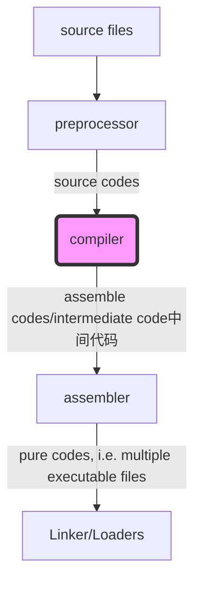
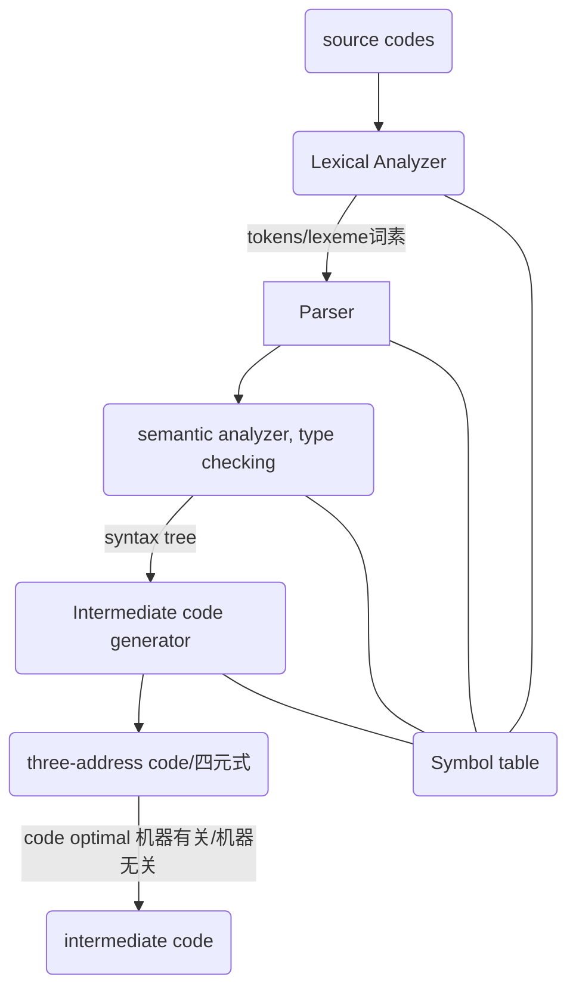

# 编译原理

## Reference

*Compilers - Principles Techniques and Tools 2nd*

## (p) 1. Compiler Intro.

**a skectch process of source code become executable file**

> source code to intermediate code is ==compiler front end==, intermediate code to executable file is ==compiler back-end==

e.g. clang use ==IR== as intermediate, all C-family languages(such as C, C++, Object-C) will compiler to ==IR==.

**More detials of compiler**

> token/lexeme always represented as tuple '<token-type, attribute-value>'.

## (p) 1. Grammer

### **Chomsky hierarchy** of ==formal grammer==

符号约定:

* ==`!$V_T$`==: terminal state, 一般用小写字母, 数字或者符号表示
* ==`!$V_N$`==: non-terminal state, 一般用大写字母表示
* ==`!$V$`==: terminal or non-terminal state
* ==`!$\epsilon$`==: empty string
* 希腊字母(e.g. `!$\alpha$`) 用来表示非终结状态和终结状态组成的串

> 以下的文法符号表示都是用的正则基本符号(Kleene operator)

### **Type-0 grammer, i.e., Unrestricted grammar/recursively enumerable**

==`!$[V\epsilon]* \rightarrow [V\epsilon]*$`==

the Automaton is called ==Turing machine==

### **Type-1 grammer, i.e., Context-sensitive grammar**

==`!$\alpha V_N \beta \rightarrow \alpha (V*) \beta$`==

the Automaton is called ==Linear-bounded non-deterministic Turing machine==

> 其中 `!$\alpha$` 和 `!$\beta$` 都是 `!$[V\epsilon]*$`

### **Type-2 grammer, i.e., context-free grammer**

==`!$V_N \rightarrow [V\epsilon]*$`==

the Automaton is called ==Non-deterministic pushdown automaton==

> 在语法分析中普遍使用

> Type-2 grammer 有两种定义

### **Type-3 grammer, i.e., regular grammer**

右线性文法(right regular, 最常用)

==`!$V_N \rightarrow V_T (V_N+)$`==

> 在词法分析中普遍使用

左线性文法(left regular, 左边跟右边的 `!$V_N$` 正好跟右线性文法相反)

==`!$V_N \rightarrow (V_N+) V_T$`==

the Automaton is called ==Finite state automaton== (DFA/NFA)

> Type-1 到 Type-3 都可以表示成一个 4-tuple: ==`!$(V, \Sigma, F, S, Z)$`==
> `!$V$` 是一个有限集合, 为所有非终结状态集, `!$\Sigma$` 为字母表(Vocabulary), `!$F$` 为 **产生式（Production）** 集合, `!$S$` 为开始状态(只有一个), `!$Z$` 为终结状态集合.

**等价性**

如果两个 Automaton 产生的所有串的集合(**Language, 语言**)相同的话, 则称这两个 Automaton 等价, 所以有定理: **对于字母表 `!$\Sigma$` 上的任一 NFA `!$M$`, 必存在 `!$\Sigma$` 上与 M 等价的 DFA `!$M'$`**.

> 然而对于 **前后文无关文法(Type-2 grammer)** 等价问题是 **不可判定** 的.

### Derivations(推导)

就是从开始符号出发, 不断用产生式的右部替换左部的状态一直到终结符号(terminals), 就是一个文法推导出来的符号串(string), 所以可能推导出来的符号串的集合为 **语言(language)**.

**语法分析(Parsing)** 就是给定一串终结符, 找出如何从这个文法(**这里的文法指的是上下文无关文法, i.e., Type-2 grammer, 如果没有特殊说明, 在语法分析中所说的文法都是上下文无关文法** )的开始符号推导出该串.

### **语法分析树(Parse Tree)** 由文法推导出来的一个终结符号串生成(yield)

* 根为开始符号(状态)
* 叶子为 `!$\epsilon$` 或终结符号
* 中间结点(interior node) 为非终结状态
* 如果一个结点 `!$A$` 有多个连接的孩子结点 `!$\alpha_1 \alpha_2 \cdots \alpha_n$`, 其中 `!$\alpha$` 表示终结状态或非终结状态, 则这个产生式表示为 `!$A \rightarrow \alpha_1 \alpha_2 \cdots \alpha_n$`, 当然 `!$A \rightarrow \epsilon$` 亦是合法的.

> 一般推导都是从最左到右替换非终结符(也就是 **最左推导** , 相反的就叫做 **最右推导** )

**二义性(Ambiguity)**

一个文法的终结符号串可以通过不止一种语法树遍历出来.

> 一般需要使用没有二义性的文法或者对有二义性的文法添加限制规则来分析语法

在很多的编程语言中, 运算符(Operator)都会有自己的 **结合性(Associativity)** 和 **优先级(Precedence)**.

* 结合性常常表现为递归, 左结合一般表示为 **(直接)左递归(也就是产生式的右部的最左状态就是左部状态, e.g., `!$A \rightarrow A \alpha$`)**

* 低优先级的运算符的产生式推导出高优先级的运算符的产生式

结合性和优先级都会影响语法分析树的生成, 常常可以作为消除二义性的方法.

## (p) 2. Lexical Analyzer

词法分析使用正则表达式(Type-3 grammer), 并且需要构造出对应的 FA(有限自动机, DFA/NFA).

### construct `!$\epsilon$`-NFA from regex

使用 Dijkstra 双栈表达式求值算法, 构造出一个中缀表达式树或者直接一边执行表达式求值一边进行正则表达式操作构造, 使用图来保存自动机.

// TODO: 正则表达式运算符优先级

### construct DFA from `!$\epsilon$`-NFA

使用 **子集构造法(subset construction)**.

// TODO

### minimized-DFA

// TODO

## (p) 3. Parser

一个文法可能有多棵语法树生成同一给定的终结符号串, 这种文法被称为具有 **二义性(ambiguous)**, 必须要附加一些规则来 **消除二义性**.

## (p) 4. Intermediate code generator